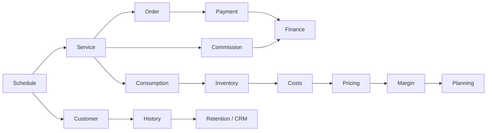
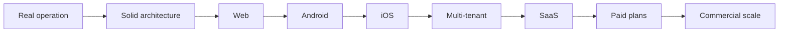

### 🌐 This profile is also available in other languages

# Quiroz

### Full Stack Developer · Product Engineer · Web · Android · iOS · SaaS

**Turning real operations into robust, secure and scalable software.**

**[🌐 Live demo](https://crm.lollahair.com/)** · **[✉️ Contact me](mailto:gestao.quiroz@gmail.com)**

---

---

## ⚡ About me

I am a **Full Stack Developer** focused on transforming complex operational processes into complete, maintainable digital products.

I work end to end across **frontend, backend, databases, authentication, authorization, security, business rules, integrations, cloud infrastructure, CI/CD and multiplatform delivery**.

My main engineering case started from a real business operation and evolved into a robust management platform running in production, architected for **Desktop Web, Mobile Web, Android and iOS**, with a roadmap toward a commercial **SaaS** model.

> **I do not build isolated screens. I build systems where operations, data, security and business logic work as one product.**

---

---

## 🚀 Main engineering case

### End-to-end management platform for beauty businesses

The product connects scheduling, customer relationship management, payments, expenses, inventory, consumption, pricing, commissions, financial results, reports, roles and permissions in one ecosystem.

| Platform | Status |
|---|---|
| 🖥️ Desktop Web | ✅ Production |
| 📱 Mobile Web | ✅ Production |
| 🤖 Android | ✅ Installable build and device testing |
| 🍎 iOS | 🛠️ Architectural foundation ready |
| ☁️ SaaS | 🚧 Commercial evolution |

### 🔒 Private source code. Public demonstration.

The source code is **proprietary and private**. Public access is limited to the demonstration environment and direct contact for commercial or technical inquiries.

**[▶ Open demo](https://crm.lollahair.com/)** · **[✉ Contact me about the product](mailto:gestao.quiroz@gmail.com?subject=Product%20inquiry)**

---

## 🧠 Integrated architecture

---

## 🧰 Core stack

**Frontend**  
`TypeScript` · `React 19` · `TanStack Router / Start` · `Vite` · `Tailwind CSS`

**Backend & Data**  
`Supabase` · `PostgreSQL` · `Edge Functions` · `Node.js` · `SQL`

**Mobile**  
`Capacitor` · `Android` · `iOS Foundation`

**Cloud & DevOps**  
`Cloudflare Workers` · `GitHub Actions` · `CI/CD` · `Git`

---

## 🔐 Security by design

Authentication → session validation → roles & permissions → application authorization → **Row Level Security** → authorized data only.

Security is part of the architecture, not a frontend-only feature.

---

## 📊 Self-hosted GitHub Analytics

The charts below are **generated inside this repository by GitHub Actions** and stored as local SVG files. They do not depend on third-party GitHub-stat services.

 

 

Private activity is shown according to GitHub's privacy settings without exposing private repository names or source code. The workflow also supports an optional `PROFILE_STATS_TOKEN` secret for authorized detailed private metrics.

---

## 🐍 Contribution Snake

<picture>
  <source media="(prefers-color-scheme: dark)" srcset="https://raw.githubusercontent.com/gestao-quiroz/gestao-quiroz/output/github-contribution-grid-snake-dark.svg">
  <source media="(prefers-color-scheme: light)" srcset="https://raw.githubusercontent.com/gestao-quiroz/gestao-quiroz/output/github-contribution-grid-snake.svg">
  
</picture>

---

## 🛣️ Product roadmap

**Quiroz · Full Stack Developer · Product Engineer**

`Web` · `Android` · `iOS` · `SaaS` · `Cloud` · `Security` · `CI/CD`

