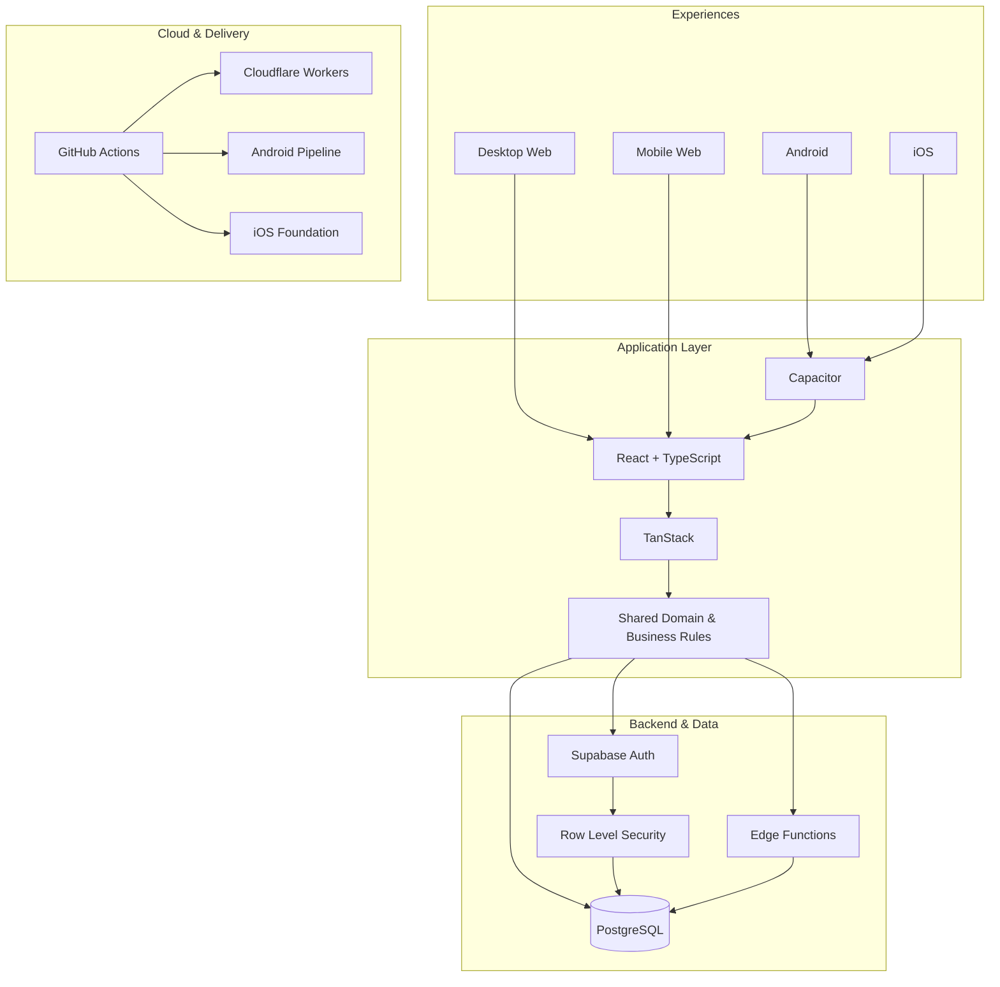

<picture>
  <source srcset="./banner.webp" type="image/webp">
  
</picture>

 

 

**[Live demo](https://crm.lollahair.com/)** · **[Contact](mailto:gestao.quiroz@gmail.com)**

## About me

I am **Inosuke**, a Full Stack Developer and Product Engineer. I build software end to end: frontend, backend, databases, authentication, authorization, business rules, security, cloud, CI/CD and multiplatform delivery.

My main engineering case started from a real operation and evolved into a robust management platform in production. The product already supports **Desktop Web, Mobile Web and Android**, has an **iOS** foundation and is being prepared for commercial evolution as **SaaS**.

> **I do not focus only on making screens work. I build systems where operations, data, security and business work as one product.**

## Main product

The source code is **proprietary and private**. Public access is limited to the demonstration environment and direct contact.

**[▶ Open live demo](https://crm.lollahair.com/)** · **[✉ Contact me about the product](mailto:gestao.quiroz@gmail.com?subject=Product%20inquiry)**

<b>Explore system modules</b>

 

Scheduling, CRM, payments, expenses, inventory, consumption, technical dosage, pricing, commissions, financial results, reports, planning, users, roles and permissions — all integrated into one operational ecosystem.

<b>Explore technical architecture</b>

 

## Multiplatform engineering

| Platform | Status |
|---|---|
| **Desktop Web** | ✅ Production |
| **Mobile Web** | ✅ Production |
| **Android** | ✅ Installable build and device testing |
| **iOS** | 🛠️ Architectural foundation ready |
| **SaaS** | 🚧 Commercial evolution in progress |

## GitHub Analytics — Beast Mode

These visuals are **generated inside this repository** using **D3 + Iconify + GitHub Actions**. No third-party stats service is required when the README is rendered.

 

 

<b>How the analytics engine works</b>

 

A GitHub Actions workflow fetches the activity GitHub allows to be exposed and generates animated SVG assets locally. The main product repository stays private. A verified minimum activity snapshot is preserved without exposing repository names, source code or private metadata. An optional `PROFILE_STATS_TOKEN` can enable more accurate authorized private metrics while remaining stored only in GitHub Actions Secrets.

## Core stack

`TypeScript` · `React` · `TanStack` · `Vite` · `Tailwind CSS`  
`Supabase` · `PostgreSQL` · `Edge Functions` · `Node.js` · `SQL`  
`Capacitor` · `Android` · `iOS`  
`Cloudflare Workers` · `GitHub Actions` · `CI/CD` · `Git`

**Inosuke · Full Stack Developer · Product Engineer**

`Web` · `Android` · `iOS` · `SaaS` · `Cloud` · `Security` · `CI/CD`

