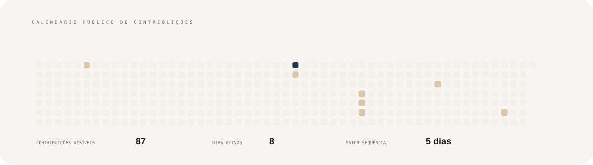

<picture>
  <source srcset="./banner.webp" type="image/webp">
  
</picture>

 

  

<picture>
  <source media="(prefers-color-scheme: dark)" srcset="./assets/premium/wordmark-dark.svg">
  
</picture>

 

**[OPEN LIVE DEMO](https://crm.lollahair.com/)** &nbsp;&nbsp;·&nbsp;&nbsp; **[CONTACT](mailto:gestao.quiroz@gmail.com)**

<picture><source media="(prefers-color-scheme: dark)" srcset="./assets/premium/divider-dark.svg"></picture>

## Profile

I am **Inosuke**, a Full Stack Developer and Product Engineer focused on building complete digital products: interface, backend, data architecture, authentication, authorization, business rules, security, cloud infrastructure, CI/CD and multiplatform delivery.

My main engineering work started from a real business operation and evolved into a robust production system. That experience defines how I approach software: it has to keep working after the demo ends and real users depend on it every day.

> **I build products where interface, data, security, automation and business operate as one architecture.**

<picture><source media="(prefers-color-scheme: dark)" srcset="./assets/premium/divider-dark.svg"></picture>

## Meu Salão

<picture><source media="(prefers-color-scheme: dark)" srcset="./assets/premium/product-dark.svg"></picture>

**Meu Salão** is my main engineering product: an integrated management platform created from the real needs of an operating beauty salon and designed to evolve into a commercial SaaS product.

It connects **scheduling, CRM, finance, service orders, payments, inventory, consumption, pricing, professionals, commissions, reports, analytics, users and permissions** in one ecosystem.

The source code is **proprietary and private**. Public access is limited to the live demonstration and direct contact for product inquiries.

**[SEE MEU SALÃO LIVE](https://crm.lollahair.com/)** &nbsp;&nbsp;·&nbsp;&nbsp; **[TALK ABOUT THE PRODUCT](mailto:gestao.quiroz@gmail.com?subject=Meu%20Sal%C3%A3o%20product%20inquiry)**

<b>Explore product capabilities</b>

 

- Daily and weekly scheduling, professionals, blocks, conflicts and appointment status.
- Client records, history, recurrence, retention, birthdays, notes and relationship management.
- Orders, billing, payments, expenses, costs, cash flow and operating results.
- Products, inventory, movements, internal consumption, technical dosage and service cost.
- Services, packages, pricing, margin, goals and break-even analysis.
- Professionals, commissions, performance, roles, users and permissions.
- Reports, indicators and integrated management visibility.
- Dedicated Desktop Web and Mobile Web experiences.
- Installable Android application and iOS foundation.
- Evolution toward multi-tenant architecture, paid plans and SaaS distribution.

<b>Explore architecture and security</b>

 

**Application:** React · TypeScript · TanStack · Vite · Tailwind CSS  
**Data:** PostgreSQL · Supabase · Edge Functions · SQL  
**Security:** Auth · RBAC · Row Level Security · access isolation  
**Mobile:** Capacitor · Android · iOS foundation  
**Cloud:** Cloudflare Workers · Supabase  
**Delivery:** GitHub Actions · CI/CD · reproducible builds and artifacts

Authorization is enforced beyond the UI, with application permissions reinforced at the database layer.

<picture><source media="(prefers-color-scheme: dark)" srcset="./assets/premium/divider-dark.svg"></picture>

## Technology

<picture><source media="(prefers-color-scheme: dark)" srcset="./assets/premium/stack-dark.svg"></picture>

My stack is chosen for the problem and long-term architecture rather than technology trends. My current work is centered around **TypeScript, React, PostgreSQL, Supabase, Cloudflare, Capacitor, Android, iOS and GitHub Actions**.

<picture><source media="(prefers-color-scheme: dark)" srcset="./assets/premium/divider-dark.svg"></picture>

## Engineering activity

<picture><source media="(prefers-color-scheme: dark)" srcset="./assets/stats/overall-activity-dark.svg"></picture>

The main indicator above displays **tracked commits as one aggregate total**, without splitting or identifying the repositories behind the activity. The primary product remains private.

The total is refreshed by GitHub Actions. Public activity is recalculated automatically while the known private development history is preserved in the aggregate without exposing source code, branches or internal repository names.

 

<picture><source media="(prefers-color-scheme: dark)" srcset="./assets/stats/heatmap-premium-dark.svg"></picture>

The calendar contains only date-level contributions GitHub exposes publicly. It is intentionally separate from the aggregate commit total above, which also reflects known private development activity.

<picture><source media="(prefers-color-scheme: dark)" srcset="./assets/premium/divider-dark.svg"></picture>

## Product direction

<picture><source media="(prefers-color-scheme: dark)" srcset="./assets/premium/roadmap-dark.svg"></picture>

**Meu Salão** already comes from real production usage. The next phase is commercial scale: expanding the mobile experience, completing iOS distribution, evolving the multi-tenant architecture and structuring paid plans.

<picture><source media="(prefers-color-scheme: dark)" srcset="./assets/premium/divider-dark.svg"></picture>

### Real product. End-to-end engineering.

**Full Stack Development · Product Engineering · Web · Android · iOS · SaaS**

 

**[crm.lollahair.com](https://crm.lollahair.com/)** &nbsp;&nbsp;·&nbsp;&nbsp; **[gestao.quiroz@gmail.com](mailto:gestao.quiroz@gmail.com)**

