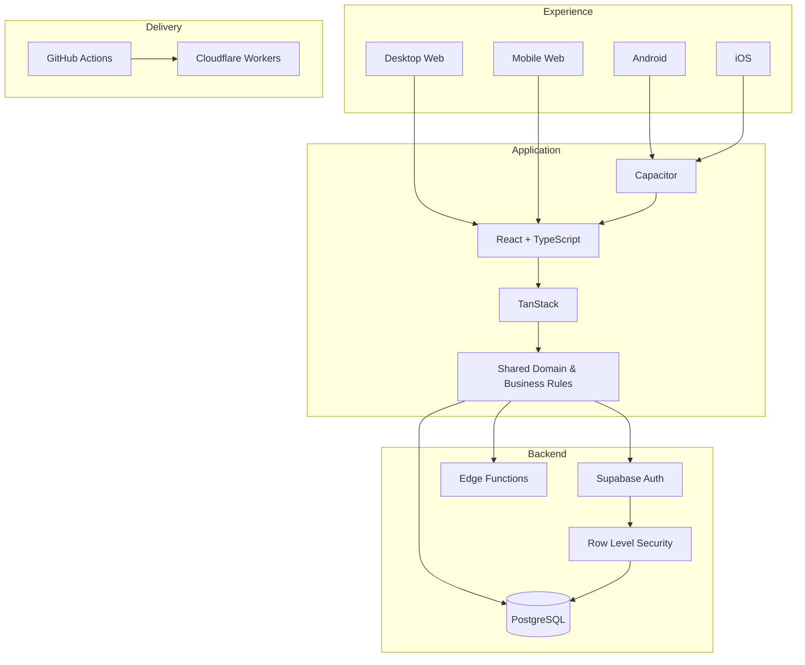

<picture>
  <source srcset="./banner.webp" type="image/webp">
  
</picture>

 

 

### Full Stack Developer · Product Engineer · Web · Android · iOS · SaaS

**I turn real operations into robust, secure and scalable digital products.**

**[🔥 Explore Meu Salão](https://crm.lollahair.com/)** · **[✉️ Contact me](mailto:gestao.quiroz@gmail.com)**

## 🐗 About Inosuke

I am a **Full Stack Developer and Product Engineer** working end to end across frontend, backend, databases, authentication, authorization, business rules, security, cloud, CI/CD and multiplatform delivery.

My main engineering case was born from a **real business operation**, moved into production and continues evolving based on daily usage.

## 🔥 Meu Salão — main product

**Meu Salão** is an end-to-end management platform for salons and beauty businesses. It centralizes scheduling, CRM, payments, expenses, inventory, consumption, pricing, commissions, financial results, reports, users and permissions.

The source code is **proprietary and private**. Public access is limited to the demonstration environment and direct contact for product inquiries.

### [▶ Open Meu Salão demo](https://crm.lollahair.com/)

| Platform | Status |
|---|---|
| 🖥️ **Desktop Web** | ✅ Production |
| 📱 **Mobile Web** | ✅ Production |
| 🤖 **Android** | ✅ Installable build and device testing |
| 🍎 **iOS** | 🛠️ Architectural foundation ready |
| ☁️ **SaaS** | 🚧 Commercial plans and paid tiers roadmap |

Meu Salão has already passed **704 commits** in its private core repository.

## ⚔️ Beast Stack

<b>🗡️ Open technical architecture</b>

 

## 📜 Beast Activity Ledger — GitHub Analytics

The charts below are **generated inside this repository with GitHub Actions**. Private source code remains private while verified activity totals are represented in aggregate form.

 

 

Current tracked activity includes **704+ Meu Salão commits** plus the automatically counted commits from this public profile repository. The public calendar is kept separate from private totals so the visualization stays accurate.

## 🐾 Product direction

**Real operation → solid architecture → Web → Android → iOS → multi-tenant → SaaS → paid plans → commercial scale.**

### **[🔥 Open demo](https://crm.lollahair.com/)** · **[✉️ Contact me](mailto:gestao.quiroz@gmail.com)**

**Inosuke · Full Stack Developer · Product Engineer**

`Web` · `Android` · `iOS` · `SaaS` · `Cloud` · `Security` · `CI/CD`

