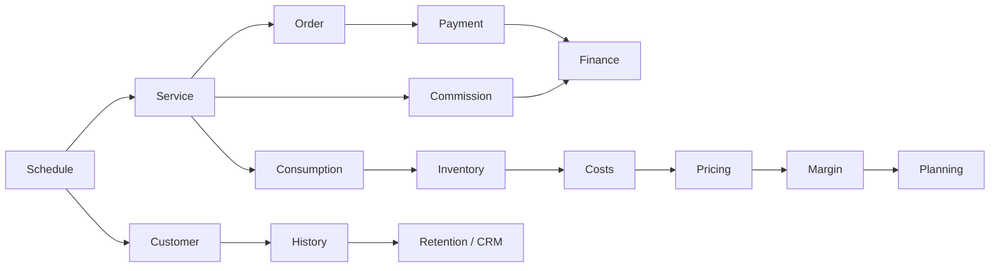
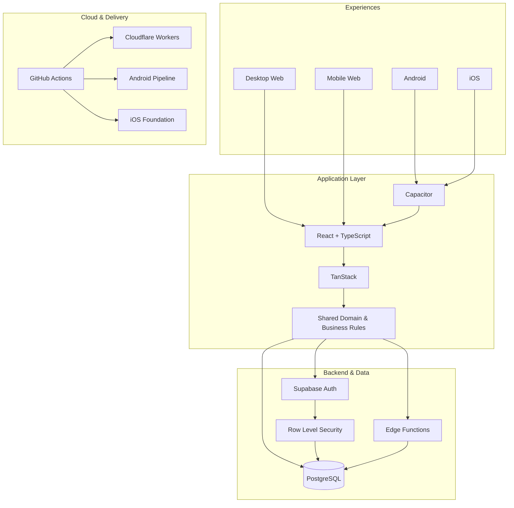
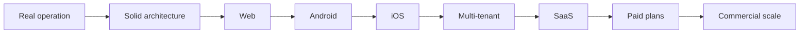

### 🌍 Language
[🇧🇷 **Português**](./README.md) · [🇺🇸 **English**](./README.en.md) · [🇪🇸 **Español**](./README.es.md) · [🇫🇷 **Français**](./README.fr.md)

# Quiroz
### Full Stack Developer · Product Engineer · Web · Android · iOS · SaaS

**Turning real operations into robust, secure and scalable software.**

---

## ⚡ About me

I am a **Full Stack Developer** focused on turning complex operational problems into complete, maintainable digital products.

I work across the entire stack: **frontend, backend, databases, authentication, authorization, security, business rules, integrations, cloud infrastructure, CI/CD and multiplatform delivery**.

My main engineering case started from a real business operation and evolved into a robust management platform running in production, architected for **Desktop Web, Mobile Web, Android and iOS**, with a roadmap toward a commercial **SaaS** model.

> **I do not build isolated screens. I build systems where operations, data, security and business logic work as one product.**

---

## 🚀 Main engineering case

### End-to-end management platform for beauty businesses

The platform combines multiple operational and management domains in one ecosystem:

- scheduling, staff calendars, blocks and availability;
- customer CRM, history, retention and recurring visits;
- orders, payments, expenses, cash flow and profitability;
- inventory, product movements, consumption and technical dosage;
- services, packages, pricing and commissions;
- reports, performance indicators and business planning;
- role-based access, permissions and secure data isolation;
- dedicated desktop and mobile experiences.

### 🔒 Private source code. Public demonstration.

The source code is **proprietary and private**. Public access is limited to the product demonstration environment.

---

## 🧠 Integrated business architecture

---

## 📱 Multiplatform

| Platform | Status |
|---|---|
| 🖥️ **Desktop Web** | ✅ In production |
| 📱 **Mobile Web** | ✅ In production |
| 🤖 **Android** | ✅ Installable build and device testing |
| 🍎 **iOS** | 🛠️ Architectural foundation ready |
| ☁️ **SaaS** | 🚧 Commercial evolution in progress |

---

## 🏗️ Technical architecture

---

## 🧰 Stack

---

## 🔐 Security by design

Authentication → session validation → roles & permissions → application authorization → **Row Level Security** → authorized data only.

I treat security as part of the architecture rather than a frontend-only concern.

---

## 🧩 Practical engineering capabilities

| Area | Application |
|---|---|
| Frontend Engineering | React, TypeScript, component architecture, desktop/mobile UX |
| Backend Engineering | Edge Functions, APIs, authentication and business rules |
| Database Engineering | PostgreSQL, SQL, relational modeling and RLS |
| Security | Auth, RBAC, RLS and access isolation |
| Mobile | Capacitor, Android and iOS foundation |
| Cloud | Cloudflare Workers and Supabase |
| DevOps | GitHub Actions, CI/CD, builds and artifacts |
| Product Engineering | From real operational problem to scalable product architecture |

---

## 🐍 GitHub activity

<picture>
  <source media="(prefers-color-scheme: dark)" srcset="https://raw.githubusercontent.com/gestao-quiroz/SobreMim/output/github-contribution-grid-snake-dark.svg">
  <source media="(prefers-color-scheme: light)" srcset="https://raw.githubusercontent.com/gestao-quiroz/SobreMim/output/github-contribution-grid-snake.svg">
  
</picture>

---

## 🛣️ Roadmap

### Interested in the product or in working together?

**Quiroz · Full Stack Developer · Product Engineer**

