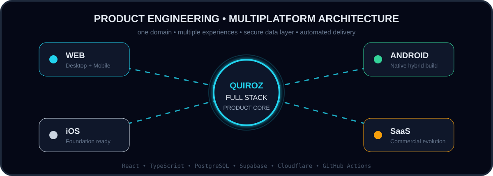
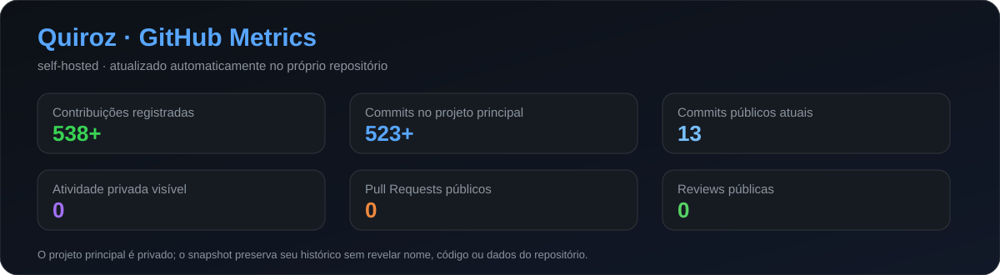
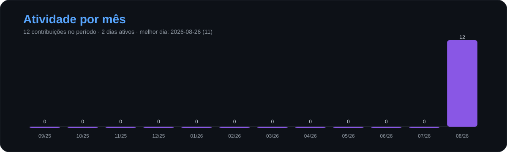
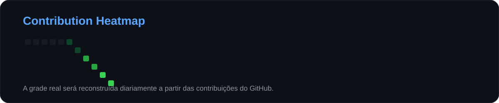

<picture>
  <source srcset="./banner.webp" type="image/webp">
  
</picture>

### 🌐 Este perfil también está disponible en otros idiomas

# Quiroz

### Full Stack Developer · Product Engineer · Web · Android · iOS · SaaS

**Transformando operaciones reales en software robusto, seguro y escalable.**

**[🌐 Ver demostración](https://crm.lollahair.com/)** · **[✉️ Contactarme](mailto:gestao.quiroz@gmail.com)**

---

---

## ⚡ Sobre mí

Soy **Desarrollador Full Stack** enfocado en convertir procesos operativos complejos en productos digitales completos y mantenibles.

Trabajo de extremo a extremo: **frontend, backend, bases de datos, autenticación, autorización, seguridad, reglas de negocio, integraciones, cloud, CI/CD y distribución multiplataforma**.

Mi principal caso de ingeniería nació de una operación real y evolucionó hasta convertirse en una plataforma de gestión robusta en producción, diseñada para **Desktop Web, Mobile Web, Android e iOS**, con evolución prevista hacia un modelo **SaaS comercial**.

> **No construyo pantallas aisladas. Construyo sistemas donde operación, datos, seguridad y negocio funcionan como un solo producto.**

---

---

## 🚀 Principal caso de ingeniería

La plataforma integra agenda, CRM, finanzas, inventario, consumo, precios, comisiones, indicadores y control de acceso en un mismo ecosistema.

| Plataforma | Estado |
|---|---|
| 🖥️ Desktop Web | ✅ En producción |
| 📱 Mobile Web | ✅ En producción |
| 🤖 Android | ✅ Build instalable y pruebas en dispositivo |
| 🍎 iOS | 🛠️ Base arquitectónica preparada |
| ☁️ SaaS | 🚧 Evolución comercial en curso |

### 🔒 Código privado. Producto demostrable.

El código fuente es **propietario y privado**. El acceso público está limitado al entorno de demostración y al contacto directo.

**[▶ Abrir demo](https://crm.lollahair.com/)** · **[✉ Hablar conmigo](mailto:gestao.quiroz@gmail.com?subject=Inter%C3%A9s%20en%20el%20producto)**

---

## 🧰 Stack principal

`TypeScript` · `React 19` · `TanStack` · `Vite` · `Tailwind CSS`  
`Supabase` · `PostgreSQL` · `Edge Functions` · `Node.js` · `SQL`  
`Capacitor` · `Android` · `iOS Foundation`  
`Cloudflare Workers` · `GitHub Actions` · `CI/CD` · `Git`

---

## 🔐 Seguridad por diseño

Autenticación → validación de sesión → roles y permisos → autorización → **Row Level Security** → solo datos autorizados.

---

## 📊 GitHub Analytics alojado en el propio repositorio

Los gráficos se generan automáticamente con **GitHub Actions** y se guardan como SVG locales dentro de este repositorio. No dependen de servicios externos de estadísticas.

 

 

La actividad privada se muestra según la configuración de privacidad de GitHub sin revelar nombres de repositorios ni código privado. El workflow también admite el secret opcional `PROFILE_STATS_TOKEN` para métricas privadas detalladas autorizadas.

---

## 🐍 Contribution Snake

<picture>
  <source media="(prefers-color-scheme: dark)" srcset="https://raw.githubusercontent.com/gestao-quiroz/gestao-quiroz/output/github-contribution-grid-snake-dark.svg">
  <source media="(prefers-color-scheme: light)" srcset="https://raw.githubusercontent.com/gestao-quiroz/gestao-quiroz/output/github-contribution-grid-snake.svg">
  
</picture>

---

**Quiroz · Full Stack Developer · Product Engineer**

`Web` · `Android` · `iOS` · `SaaS` · `Cloud` · `Security` · `CI/CD`

