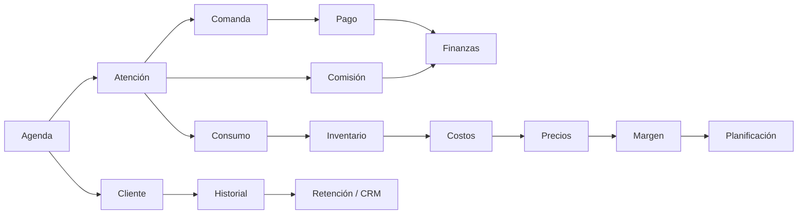
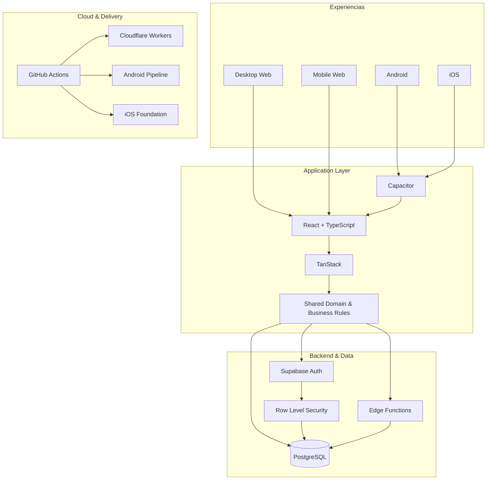

### 🌍 Idioma
[🇧🇷 **Português**](./README.md) · [🇺🇸 **English**](./README.en.md) · [🇪🇸 **Español**](./README.es.md) · [🇫🇷 **Français**](./README.fr.md)

# Quiroz
### Full Stack Developer · Product Engineer · Web · Android · iOS · SaaS

**Transformando operaciones reales en software robusto, seguro y escalable.**

---

## ⚡ Sobre mí

Soy **Desarrollador Full Stack** enfocado en convertir problemas operativos complejos en productos digitales completos, mantenibles y preparados para crecer.

Trabajo de extremo a extremo: **frontend, backend, bases de datos, autenticación, autorización, seguridad, reglas de negocio, integraciones, cloud, CI/CD y distribución multiplataforma**.

Mi principal caso de ingeniería nació de una operación real y evolucionó hasta convertirse en una plataforma de gestión robusta en producción, diseñada para **Desktop Web, Mobile Web, Android e iOS**, con una evolución prevista hacia un modelo **SaaS comercial**.

> **No construyo pantallas aisladas. Construyo sistemas donde operación, datos, seguridad y negocio funcionan como un solo producto.**

---

## 🚀 Principal caso de ingeniería

### Plataforma integral de gestión para negocios de belleza

La plataforma integra agenda, CRM, finanzas, inventario, consumo, precios, comisiones, indicadores y control de acceso en un mismo ecosistema.

### 🔒 Código privado. Producto demostrable.

El código fuente es **propietario y privado**. El acceso público está limitado al entorno de demostración.

---

## 🧠 Arquitectura integrada

---

## 📱 Multiplataforma

| Plataforma | Estado |
|---|---|
| 🖥️ Desktop Web | ✅ En producción |
| 📱 Mobile Web | ✅ En producción |
| 🤖 Android | ✅ Build instalable y pruebas en dispositivo |
| 🍎 iOS | 🛠️ Base arquitectónica preparada |
| ☁️ SaaS | 🚧 Evolución comercial en curso |

---

## 🏗️ Arquitectura técnica

---

## 🧰 Stack

---

## 🔐 Seguridad por diseño

Autenticación → validación de sesión → roles y permisos → autorización de aplicación → **Row Level Security** → solo datos autorizados.

---

## 🧩 Capacidades prácticas

| Área | Aplicación |
|---|---|
| Frontend Engineering | React, TypeScript, arquitectura de componentes y UX desktop/mobile |
| Backend Engineering | Edge Functions, APIs, autenticación y reglas de negocio |
| Database Engineering | PostgreSQL, SQL, modelado relacional y RLS |
| Seguridad | Auth, RBAC, RLS y aislamiento de acceso |
| Mobile | Capacitor, Android y base para iOS |
| Cloud | Cloudflare Workers y Supabase |
| DevOps | GitHub Actions, CI/CD, builds y artefactos |
| Product Engineering | Del problema operativo real a la arquitectura de producto |

---

## 🐍 Actividad en GitHub

<picture>
  <source media="(prefers-color-scheme: dark)" srcset="https://raw.githubusercontent.com/gestao-quiroz/SobreMim/output/github-contribution-grid-snake-dark.svg">
  <source media="(prefers-color-scheme: light)" srcset="https://raw.githubusercontent.com/gestao-quiroz/SobreMim/output/github-contribution-grid-snake.svg">
  
</picture>

---

### ¿Quieres conocer el producto o hablar de un proyecto?

**Quiroz · Full Stack Developer · Product Engineer**

