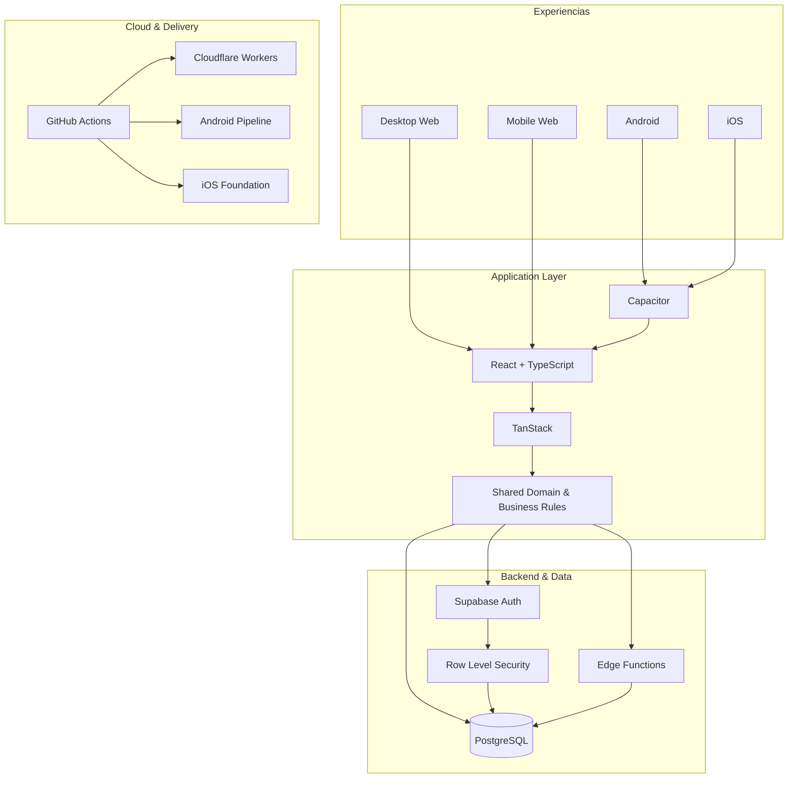

<picture>
  <source srcset="./banner.webp" type="image/webp">
  
</picture>

 

 

**[Ver demostración](https://crm.lollahair.com/)** · **[Contacto](mailto:gestao.quiroz@gmail.com)**

## Sobre mí

Soy **Inosuke**, Desarrollador Full Stack y Product Engineer. Construyo software de extremo a extremo: frontend, backend, bases de datos, autenticación, autorización, reglas de negocio, seguridad, cloud, CI/CD y distribución multiplataforma.

Mi principal caso de ingeniería nació de una operación real y evolucionó hasta convertirse en una plataforma robusta de gestión en producción. El producto ya funciona en **Desktop Web, Mobile Web y Android**, tiene base para **iOS** y está siendo preparado para evolucionar comercialmente como **SaaS**.

> **No me concentro solamente en hacer que una pantalla funcione. Construyo sistemas donde operación, datos, seguridad y negocio funcionan como un solo producto.**

## Producto principal

El código fuente es **propietario y privado**. Públicamente mantengo únicamente el entorno de demostración y el canal de contacto.

**[▶ Abrir demostración](https://crm.lollahair.com/)** · **[✉ Hablar conmigo](mailto:gestao.quiroz@gmail.com?subject=Inter%C3%A9s%20en%20el%20producto)**

<b>Explorar módulos del sistema</b>

 

Agenda, CRM, pagos, gastos, inventario, consumo, dosificación técnica, precios, comisiones, resultados financieros, informes, planificación, usuarios, cargos y permisos — todo integrado en un mismo ecosistema operativo.

<b>Explorar arquitectura técnica</b>

 

## Ingeniería multiplataforma

| Plataforma | Estado |
|---|---|
| **Desktop Web** | ✅ En producción |
| **Mobile Web** | ✅ En producción |
| **Android** | ✅ Build instalable y pruebas en dispositivo |
| **iOS** | 🛠️ Base arquitectónica preparada |
| **SaaS** | 🚧 Evolución comercial en curso |

## GitHub Analytics — Beast Mode

Los gráficos se **generan dentro de este repositorio** usando **D3 + Iconify + GitHub Actions**. No dependen de un servicio externo de estadísticas cuando se renderiza el README.

 

 

<b>Cómo funciona el motor de métricas</b>

 

Un workflow de GitHub Actions consulta la actividad que GitHub permite exponer y genera los SVG animados localmente. El repositorio principal del producto permanece privado. El perfil conserva un mínimo verificado de actividad sin revelar nombres de repositorios, código fuente ni metadatos privados. El secret opcional `PROFILE_STATS_TOKEN` puede habilitar métricas privadas autorizadas con mayor precisión.

## Stack principal

`TypeScript` · `React` · `TanStack` · `Vite` · `Tailwind CSS`  
`Supabase` · `PostgreSQL` · `Edge Functions` · `Node.js` · `SQL`  
`Capacitor` · `Android` · `iOS`  
`Cloudflare Workers` · `GitHub Actions` · `CI/CD` · `Git`

**Inosuke · Full Stack Developer · Product Engineer**

`Web` · `Android` · `iOS` · `SaaS` · `Cloud` · `Security` · `CI/CD`

