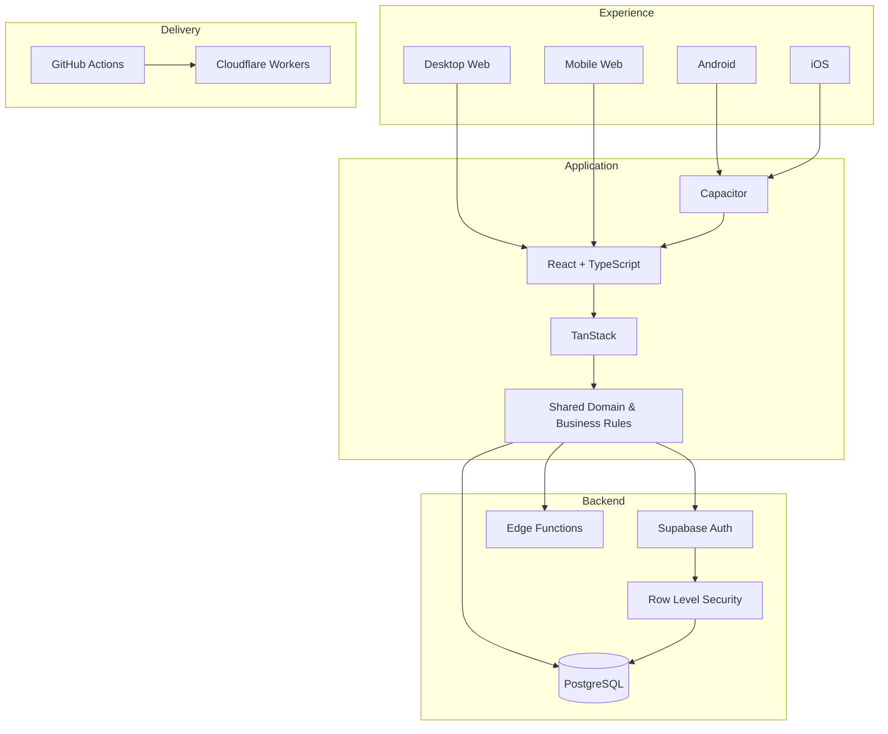

<picture>
  <source srcset="./banner.webp" type="image/webp">
  
</picture>

 

 

### Full Stack Developer · Product Engineer · Web · Android · iOS · SaaS

**Transformo operaciones reales en productos digitales robustos, seguros y escalables.**

**[🔥 Conocer Meu Salão](https://crm.lollahair.com/)** · **[✉️ Contactarme](mailto:gestao.quiroz@gmail.com)**

## 🐗 Sobre Inosuke

Soy **Desarrollador Full Stack y Product Engineer**. Trabajo de extremo a extremo: frontend, backend, bases de datos, autenticación, autorización, reglas de negocio, seguridad, cloud, CI/CD y distribución multiplataforma.

Mi principal caso de ingeniería nació de una **operación real**, entró en producción y continúa evolucionando según el uso diario.

## 🔥 Meu Salão — producto principal

**Meu Salão** es una plataforma completa de gestión para salones y negocios de belleza. Centraliza agenda, CRM, cobros, gastos, inventario, consumo, precios, comisiones, resultados financieros, informes, usuarios y permisos.

El código fuente es **propietario y privado**. El acceso público se limita al entorno de demostración y al contacto directo.

### [▶ Abrir demo de Meu Salão](https://crm.lollahair.com/)

| Plataforma | Estado |
|---|---|
| 🖥️ **Desktop Web** | ✅ En producción |
| 📱 **Mobile Web** | ✅ En producción |
| 🤖 **Android** | ✅ Build instalable y pruebas en dispositivo |
| 🍎 **iOS** | 🛠️ Base arquitectónica preparada |
| ☁️ **SaaS** | 🚧 Preparación comercial y planes de pago |

Meu Salão ya supera **704 commits** en su repositorio principal privado.

## ⚔️ Beast Stack

<b>🗡️ Abrir arquitectura técnica</b>

 

## 📜 Beast Activity Ledger — GitHub Analytics

Los gráficos se **generan dentro de este repositorio mediante GitHub Actions**. El código privado permanece oculto y la actividad verificada se presenta de forma agregada.

 

 

La actividad rastreada incluye **704+ commits de Meu Salão** más los commits contabilizados automáticamente en este repositorio público del perfil.

## 🐾 Dirección del producto

**Operación real → arquitectura sólida → Web → Android → iOS → multi-tenant → SaaS → planes pagos → escala comercial.**

### **[🔥 Abrir demo](https://crm.lollahair.com/)** · **[✉️ Contactarme](mailto:gestao.quiroz@gmail.com)**

**Inosuke · Full Stack Developer · Product Engineer**

`Web` · `Android` · `iOS` · `SaaS` · `Cloud` · `Security` · `CI/CD`

