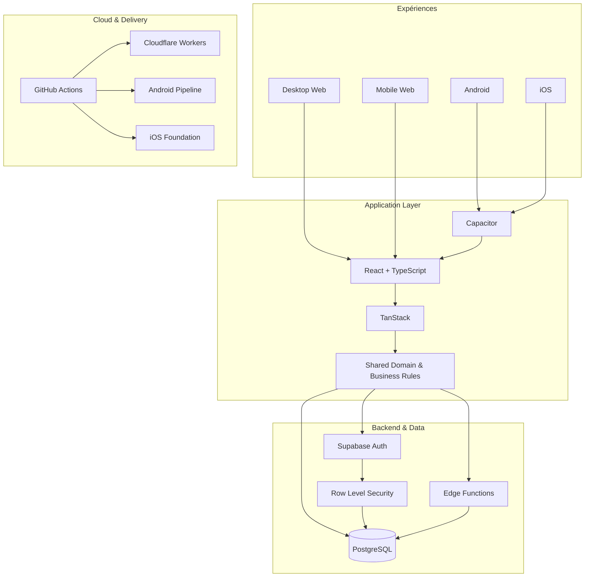

<picture>
  <source srcset="./banner.webp" type="image/webp">
  
</picture>

 

 

**[Voir la démonstration](https://crm.lollahair.com/)** · **[Contact](mailto:gestao.quiroz@gmail.com)**

## À propos de moi

Je suis **Inosuke**, Développeur Full Stack et Product Engineer. Je construis des logiciels de bout en bout : frontend, backend, bases de données, authentification, autorisation, règles métier, sécurité, cloud, CI/CD et distribution multiplateforme.

Mon principal cas d’ingénierie est né d’une opération réelle et a évolué vers une plateforme de gestion robuste en production. Le produit fonctionne déjà sur **Desktop Web, Mobile Web et Android**, possède une fondation **iOS** et est préparé pour une évolution commerciale en **SaaS**.

> **Je ne cherche pas seulement à faire fonctionner un écran. Je construis des systèmes où opérations, données, sécurité et métier fonctionnent comme un seul produit.**

## Produit principal

Le code source est **propriétaire et privé**. Seuls l’environnement de démonstration et le canal de contact sont publics.

**[▶ Ouvrir la démonstration](https://crm.lollahair.com/)** · **[✉ Me contacter](mailto:gestao.quiroz@gmail.com?subject=Int%C3%A9r%C3%AAt%20pour%20le%20produit)**

<b>Explorer les modules du système</b>

 

Agenda, CRM, paiements, dépenses, stock, consommation, dosage technique, tarification, commissions, résultats financiers, rapports, planification, utilisateurs, rôles et permissions — intégrés dans un même écosystème opérationnel.

<b>Explorer l’architecture technique</b>

 

## Ingénierie multiplateforme

| Plateforme | État |
|---|---|
| **Desktop Web** | ✅ En production |
| **Mobile Web** | ✅ En production |
| **Android** | ✅ Build installable et tests sur appareil |
| **iOS** | 🛠️ Fondation architecturale prête |
| **SaaS** | 🚧 Évolution commerciale en cours |

## GitHub Analytics — Beast Mode

Les graphiques sont **générés dans ce dépôt** avec **D3 + Iconify + GitHub Actions**. Aucun service externe de statistiques n’est nécessaire au moment de l’affichage du README.

 

 

<b>Fonctionnement du moteur de métriques</b>

 

Un workflow GitHub Actions récupère l’activité que GitHub autorise à exposer et génère localement les SVG animés. Le dépôt principal du produit reste privé. Le profil conserve un minimum d’activité déjà vérifié sans révéler les noms des dépôts, le code source ni les métadonnées privées. Le secret optionnel `PROFILE_STATS_TOKEN` peut permettre des métriques privées autorisées plus précises.

## Stack principale

`TypeScript` · `React` · `TanStack` · `Vite` · `Tailwind CSS`  
`Supabase` · `PostgreSQL` · `Edge Functions` · `Node.js` · `SQL`  
`Capacitor` · `Android` · `iOS`  
`Cloudflare Workers` · `GitHub Actions` · `CI/CD` · `Git`

**Inosuke · Full Stack Developer · Product Engineer**

`Web` · `Android` · `iOS` · `SaaS` · `Cloud` · `Security` · `CI/CD`

