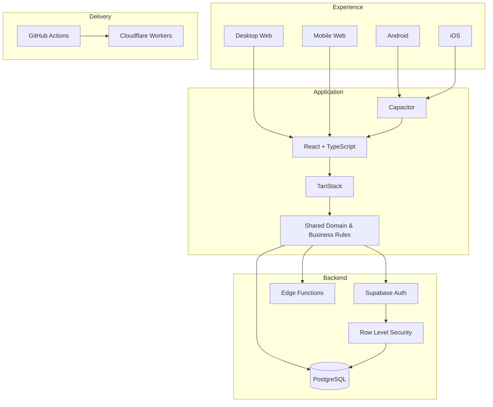

<picture>
  <source srcset="./banner.webp" type="image/webp">
  
</picture>

 

 

### Full Stack Developer · Product Engineer · Web · Android · iOS · SaaS

**Je transforme des opérations réelles en produits numériques robustes, sécurisés et évolutifs.**

**[🔥 Découvrir Meu Salão](https://crm.lollahair.com/)** · **[✉️ Me contacter](mailto:gestao.quiroz@gmail.com)**

## 🐗 À propos d’Inosuke

Je suis **Développeur Full Stack et Product Engineer**. Je travaille de bout en bout : frontend, backend, bases de données, authentification, autorisation, règles métier, sécurité, cloud, CI/CD et distribution multiplateforme.

Mon principal cas d’ingénierie est né d’une **opération réelle**, a été mis en production et continue d’évoluer selon l’usage quotidien.

## 🔥 Meu Salão — produit principal

**Meu Salão** est une plateforme complète de gestion pour les salons et entreprises de beauté. Elle centralise agenda, CRM, paiements, dépenses, stock, consommation, tarification, commissions, résultats financiers, rapports, utilisateurs et permissions.

Le code source est **propriétaire et privé**. L’accès public est limité à l’environnement de démonstration et au contact direct.

### [▶ Ouvrir la démo de Meu Salão](https://crm.lollahair.com/)

| Plateforme | État |
|---|---|
| 🖥️ **Desktop Web** | ✅ En production |
| 📱 **Mobile Web** | ✅ En production |
| 🤖 **Android** | ✅ Build installable et tests sur appareil |
| 🍎 **iOS** | 🛠️ Fondation architecturale prête |
| ☁️ **SaaS** | 🚧 Préparation commerciale et offres payantes |

Meu Salão dépasse déjà **704 commits** dans son dépôt principal privé.

## ⚔️ Beast Stack

<b>🗡️ Ouvrir l’architecture technique</b>

 

## 📜 Beast Activity Ledger — GitHub Analytics

Les graphiques sont **générés dans ce dépôt via GitHub Actions**. Le code privé reste caché tandis que l’activité vérifiée est présentée sous forme agrégée.

 

 

L’activité suivie comprend **704+ commits Meu Salão** ainsi que les commits comptabilisés automatiquement dans ce dépôt public de profil.

## 🐾 Direction produit

**Opération réelle → architecture solide → Web → Android → iOS → multi-tenant → SaaS → offres payantes → échelle commerciale.**

### **[🔥 Ouvrir la démo](https://crm.lollahair.com/)** · **[✉️ Me contacter](mailto:gestao.quiroz@gmail.com)**

**Inosuke · Full Stack Developer · Product Engineer**

`Web` · `Android` · `iOS` · `SaaS` · `Cloud` · `Security` · `CI/CD`

