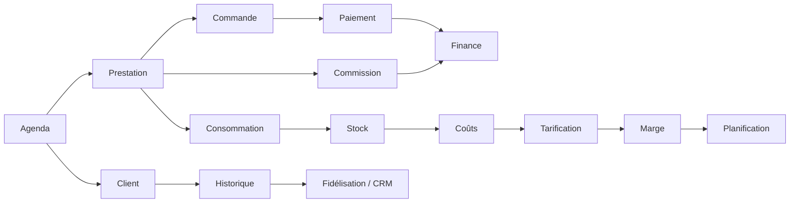
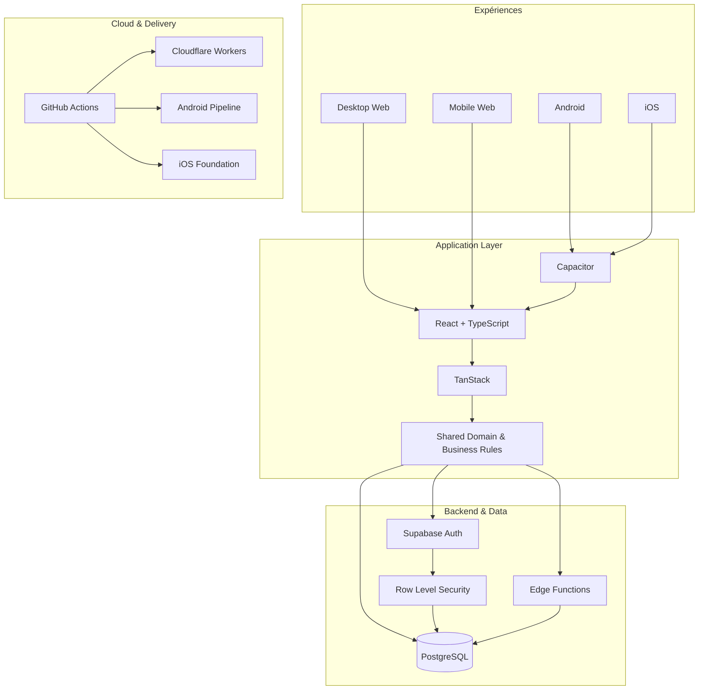

### 🌍 Langue
[🇧🇷 **Português**](./README.md) · [🇺🇸 **English**](./README.en.md) · [🇪🇸 **Español**](./README.es.md) · [🇫🇷 **Français**](./README.fr.md)

# Quiroz
### Full Stack Developer · Product Engineer · Web · Android · iOS · SaaS

**Transformer des opérations réelles en logiciels robustes, sécurisés et évolutifs.**

---

## ⚡ À propos de moi

Je suis **Développeur Full Stack**, spécialisé dans la transformation de problèmes opérationnels complexes en produits numériques complets et maintenables.

J’interviens sur l’ensemble de la chaîne : **frontend, backend, bases de données, authentification, autorisation, sécurité, règles métier, intégrations, cloud, CI/CD et distribution multiplateforme**.

Mon principal cas d’ingénierie est né d’une opération réelle et a évolué vers une plateforme de gestion robuste en production, conçue pour **Desktop Web, Mobile Web, Android et iOS**, avec une évolution prévue vers un modèle **SaaS commercial**.

> **Je ne construis pas seulement des écrans. Je construis des systèmes où opérations, données, sécurité et logique métier fonctionnent comme un seul produit.**

---

## 🚀 Principal cas d’ingénierie

### Plateforme complète de gestion pour les entreprises de beauté

La plateforme regroupe agenda, CRM, finance, stock, consommation, tarification, commissions, indicateurs et contrôle d’accès dans un même écosystème.

### 🔒 Code privé. Produit démontrable.

Le code source est **propriétaire et privé**. L’accès public est limité à l’environnement de démonstration.

---

## 🧠 Architecture métier intégrée

---

## 📱 Multiplateforme

| Plateforme | État |
|---|---|
| 🖥️ Desktop Web | ✅ En production |
| 📱 Mobile Web | ✅ En production |
| 🤖 Android | ✅ Build installable et tests sur appareil |
| 🍎 iOS | 🛠️ Fondation architecturale prête |
| ☁️ SaaS | 🚧 Évolution commerciale en cours |

---

## 🏗️ Architecture technique

---

## 🧰 Stack

---

## 🔐 Sécurité dès la conception

Authentification → validation de session → rôles et permissions → autorisation applicative → **Row Level Security** → données autorisées uniquement.

---

## 🧩 Compétences appliquées en pratique

| Domaine | Application |
|---|---|
| Frontend Engineering | React, TypeScript, architecture de composants, UX desktop/mobile |
| Backend Engineering | Edge Functions, APIs, authentification et règles métier |
| Database Engineering | PostgreSQL, SQL, modélisation relationnelle et RLS |
| Sécurité | Auth, RBAC, RLS et isolation des accès |
| Mobile | Capacitor, Android et base iOS |
| Cloud | Cloudflare Workers et Supabase |
| DevOps | GitHub Actions, CI/CD, builds et artefacts |
| Product Engineering | Du problème opérationnel réel à l’architecture produit |

---

## 🐍 Activité GitHub

<picture>
  <source media="(prefers-color-scheme: dark)" srcset="https://raw.githubusercontent.com/gestao-quiroz/SobreMim/output/github-contribution-grid-snake-dark.svg">
  <source media="(prefers-color-scheme: light)" srcset="https://raw.githubusercontent.com/gestao-quiroz/SobreMim/output/github-contribution-grid-snake.svg">
  
</picture>

---

### Vous souhaitez découvrir le produit ou discuter d’un projet ?

**Quiroz · Full Stack Developer · Product Engineer**

