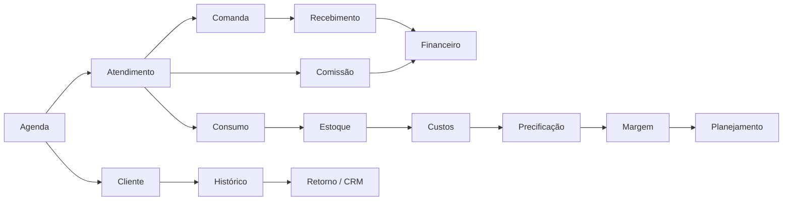
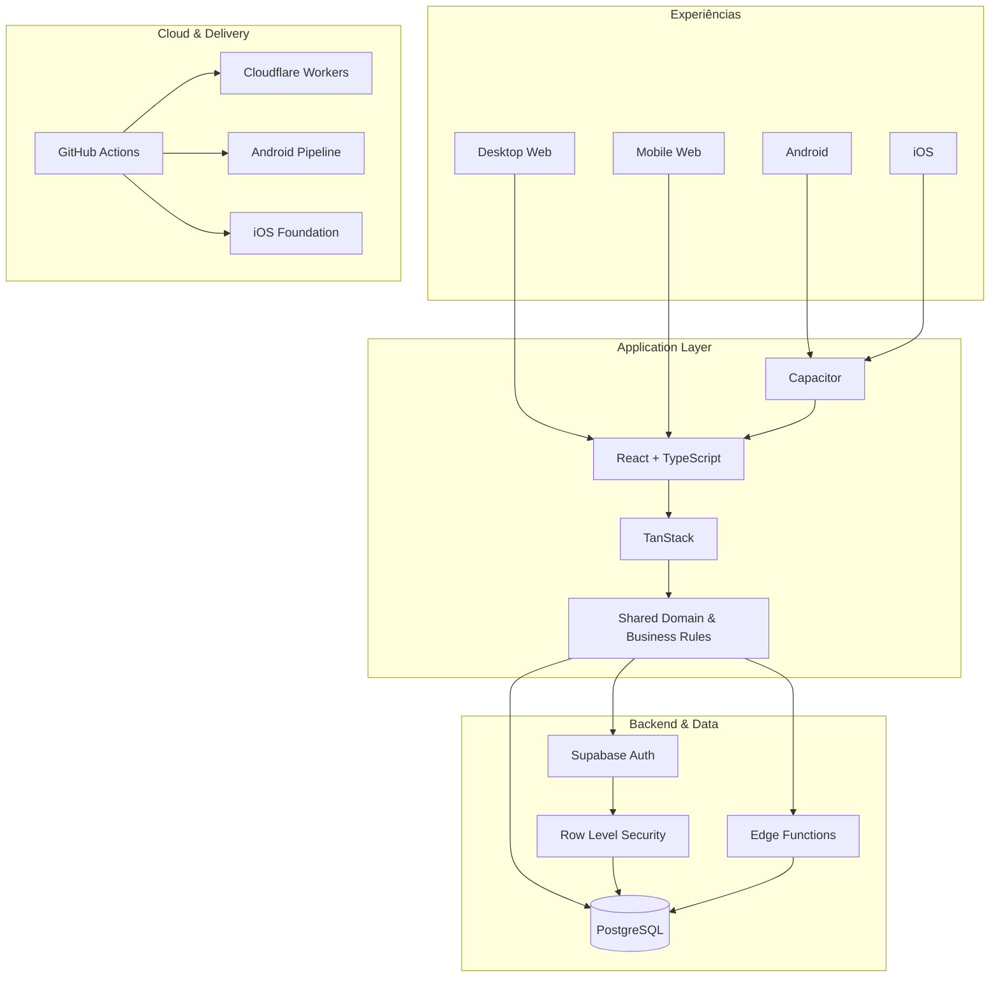
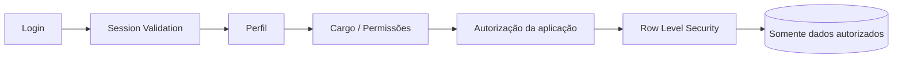
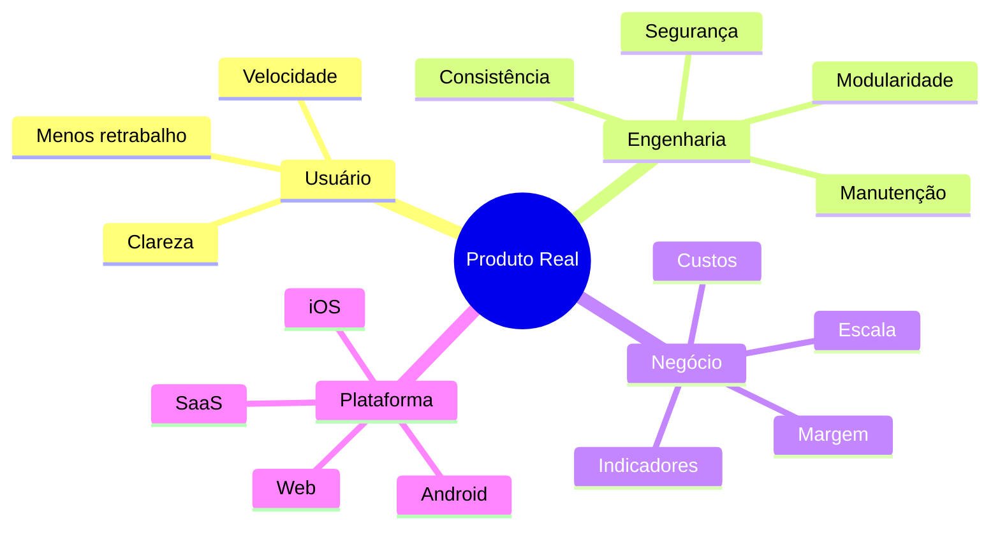
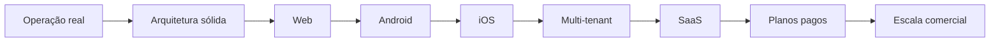

 

### 🌍 Idioma / Language

[🇧🇷 **Português**](./README.md) · [🇺🇸 **English**](./README.en.md) · [🇪🇸 **Español**](./README.es.md) · [🇫🇷 **Français**](./README.fr.md)

 

# Quiroz

### Full Stack Developer · Product Engineer · Web · Android · iOS · SaaS

**Transformando operações reais em software robusto, seguro e escalável.**

---

  

---

## ⚡ Sobre mim

Sou **Desenvolvedor Full Stack** com foco em transformar processos complexos em produtos digitais completos, claros e sustentáveis.

Atuo de ponta a ponta: **frontend, backend, banco de dados, autenticação, autorização, segurança, regras de negócio, integrações, cloud, CI/CD e distribuição multiplataforma**.

Meu principal case nasceu de uma necessidade operacional real e evoluiu para uma plataforma robusta de gestão, utilizada em produção e arquitetada para **Desktop Web, Mobile Web, Android e iOS**, com evolução planejada para um modelo **SaaS comercial**.

> **Não construo apenas telas. Construo sistemas em que operação, dados, segurança e negócio funcionam como um único produto.**

---

  

---

## 🚀 Principal case de engenharia

### Plataforma completa de gestão para negócios de beleza

O produto conecta diferentes áreas operacionais e gerenciais em um mesmo ecossistema.

<table>
<tr>
<td width="50%" valign="top">

### 🗓️ Operação
- Agenda diária e semanal
- Gestão por profissional
- Bloqueios e indisponibilidades
- Sinal via PIX
- Status de atendimento
- Detecção de conflitos
- WhatsApp operacional
- UX específica para desktop e mobile

</td>
<td width="50%" valign="top">

### 👥 CRM
- Cadastro e histórico de clientes
- Atendimentos e recorrência
- Retorno e repescagem
- Aniversários
- Receita histórica
- Ticket médio
- Cancelamentos e no-shows
- Relacionamento e observações

</td>
</tr>
<tr>
<td width="50%" valign="top">

### 💰 Financeiro
- Comandas e cobranças
- Recebimentos
- Múltiplas formas de pagamento
- Despesas e custos
- Fluxo de caixa
- Resultado operacional
- Margem e rentabilidade
- Metas e ponto de equilíbrio

</td>
<td width="50%" valign="top">

### 📦 Gestão
- Produtos e estoque
- Entradas, saídas e consumo
- Dose técnica
- Custo por atendimento
- Serviços e pacotes
- Precificação
- Comissões
- Relatórios e indicadores

</td>
</tr>
</table>

### 🔒 Código privado. Produto demonstrável.

O código-fonte desse sistema é **proprietário e permanece privado**. A apresentação pública é feita somente pelo ambiente de demonstração.

---

## 🧠 O diferencial: integração real entre módulos

Não é um CRUD com telas isoladas. As regras de negócio conectam os módulos para manter operação, financeiro, estoque e relacionamento consistentes.

---

## 📱 Multiplataforma

| Plataforma | Estado |
|---|---|
| 🖥️ **Desktop Web** | ✅ Em operação |
| 📱 **Mobile Web** | ✅ Em operação |
| 🤖 **Android** | ✅ Build instalável e testes em dispositivo |
| 🍎 **iOS** | 🛠️ Fundação arquitetural preparada |
| ☁️ **SaaS** | 🚧 Evolução para comercialização e planos pagos |

A experiência mobile não é uma miniatura do desktop: as duas interfaces compartilham domínio e dados, mas são pensadas para contextos diferentes de uso.

---

## 🏗️ Arquitetura técnica

---

## 🧰 Stack

---

## 🔐 Segurança como parte da arquitetura

- autenticação centralizada;
- autorização por cargo e permissão;
- isolamento de dados no banco;
- políticas RLS;
- validação de sessão;
- operações administrativas restritas;
- proteção que não depende apenas do frontend.

---

## 🧩 Competências aplicadas na prática

| Área | Aplicação |
|---|---|
| **Frontend Engineering** | React, TypeScript, componentização, UX desktop/mobile |
| **Backend Engineering** | Edge Functions, autenticação, APIs e regras de negócio |
| **Database Engineering** | PostgreSQL, modelagem relacional, SQL e RLS |
| **Security Engineering** | Auth, RBAC, RLS e isolamento de acesso |
| **Mobile Engineering** | Capacitor, Android e base para iOS |
| **Cloud** | Cloudflare Workers e Supabase |
| **DevOps** | GitHub Actions, CI/CD, builds e artefatos |
| **Product Engineering** | Do problema real à arquitetura de produto |
| **Business Systems** | CRM, agenda, financeiro, estoque, custos, comissões e relatórios |

---

## 🎯 Como penso produto

> **Software bom não é apenas o que funciona na apresentação. É o que continua funcionando quando entra na rotina de uma operação real.**

---

## 🐍 Atividade no GitHub

<picture>
  <source media="(prefers-color-scheme: dark)" srcset="https://raw.githubusercontent.com/gestao-quiroz/SobreMim/output/github-contribution-grid-snake-dark.svg">
  <source media="(prefers-color-scheme: light)" srcset="https://raw.githubusercontent.com/gestao-quiroz/SobreMim/output/github-contribution-grid-snake.svg">
  
</picture>

Esta animação é gerada automaticamente por GitHub Actions e fica hospedada no próprio repositório.

---

## 🛣️ Roadmap

---

<b>🧠 Princípios de engenharia que valorizo</b>

 

- Código modular e compreensível
- Regras de negócio centralizadas
- Segurança no backend e no banco
- Interfaces pensadas para uso diário
- Automação que reduz trabalho real
- Dados consistentes entre módulos
- Pipelines reproduzíveis
- Evolução sem quebrar funcionalidades existentes
- Produto orientado ao problema, não à moda tecnológica

---

### Quer conhecer o produto ou conversar sobre um projeto?

  

**Quiroz · Full Stack Developer · Product Engineer**

`Web` · `Android` · `iOS` · `SaaS` · `Cloud` · `Security` · `CI/CD`

