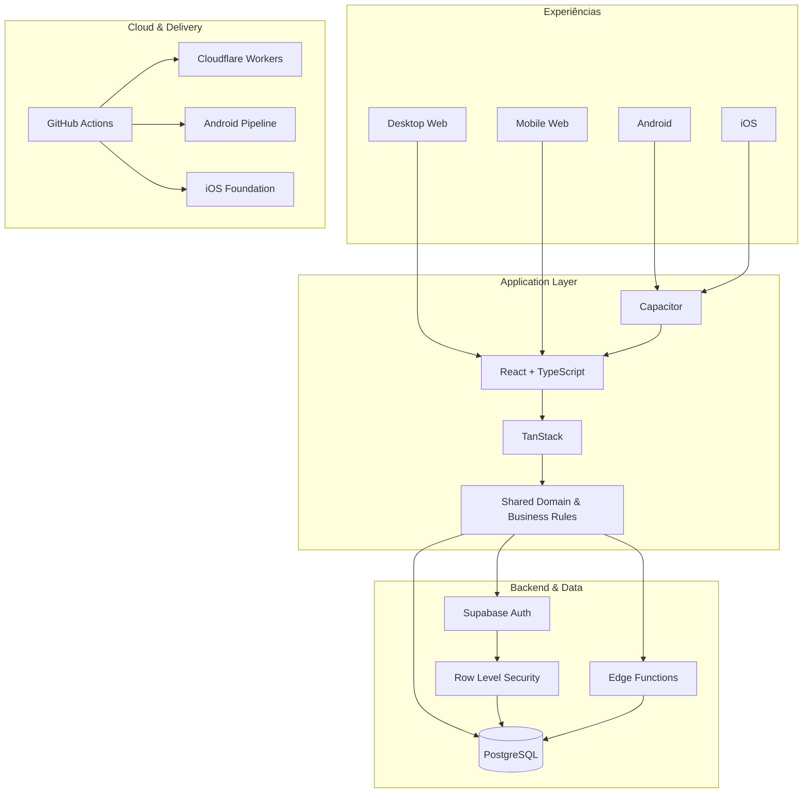
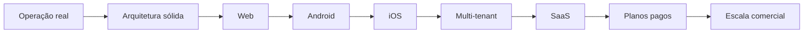

<picture>
  <source srcset="./banner.webp" type="image/webp">
  
</picture>

 

 

**[Abrir demonstração](https://crm.lollahair.com/)** · **[Contato](mailto:gestao.quiroz@gmail.com)**

  

## Sobre mim

Sou **Inosuke**, Desenvolvedor Full Stack e Product Engineer. Construo software de ponta a ponta: interface, backend, banco de dados, autenticação, autorização, regras de negócio, segurança, cloud, CI/CD e distribuição multiplataforma.

Meu principal case nasceu de uma operação real e evoluiu para uma plataforma robusta de gestão em produção. O produto já atende **Web Desktop, Web Mobile e Android**, possui fundação para **iOS** e está sendo preparado para evolução comercial como **SaaS**.

> **Meu foco não é apenas fazer a tela funcionar. É fazer operação, dados, segurança e negócio funcionarem como um único sistema.**

## Projeto principal

### Plataforma de gestão para negócios de beleza

O código-fonte é **proprietário e privado**. Publicamente, mantenho apenas a demonstração do produto e o canal de contato para interessados.

**[▶ Ver produto em funcionamento](https://crm.lollahair.com/)** · **[✉ Falar comigo sobre o projeto](mailto:gestao.quiroz@gmail.com?subject=Interesse%20no%20produto%20de%20gest%C3%A3o)**

<b>Explorar módulos do sistema</b>

 

- **Agenda & operação:** agenda diária/semanal, profissionais, bloqueios, status, conflitos e sinal via PIX.
- **CRM:** clientes, histórico, recorrência, retorno, aniversários, ticket médio, cancelamentos e relacionamento.
- **Financeiro:** comandas, cobranças, recebimentos, despesas, custos, fluxo de caixa, margens, metas e ponto de equilíbrio.
- **Produtos & estoque:** entradas, saídas, consumo interno, dose técnica, custo por atendimento e inventário.
- **Equipe:** profissionais, comissões, desempenho, cargos e permissões.
- **Gestão:** precificação, relatórios, indicadores, planejamento e visão operacional integrada.

<b>Explorar arquitetura técnica</b>

 

## Engenharia multiplataforma

| Plataforma | Estado |
|---|---|
| **Desktop Web** | ✅ Em produção |
| **Mobile Web** | ✅ Em produção |
| **Android** | ✅ Build instalável e testes em dispositivo |
| **iOS** | 🛠️ Fundação arquitetural preparada |
| **SaaS** | 🚧 Evolução comercial em andamento |

A experiência mobile não é uma miniatura do desktop: as interfaces compartilham domínio e dados, mas são projetadas para contextos diferentes de uso.

  

## GitHub Analytics — Beast Mode

Os gráficos abaixo são **gerados dentro deste próprio repositório**, usando **D3 + Iconify + GitHub Actions**. Não dependem de GitHub Readme Stats, Streak Stats ou outro servidor externo no momento da visualização.

 

 

<b>Como os gráficos funcionam</b>

 

O motor visual roda automaticamente pelo GitHub Actions, consulta os dados de atividade permitidos pelo GitHub e gera SVGs animados diretamente em `assets/`.

O repositório principal do produto permanece **privado**. O perfil preserva um snapshot mínimo já verificado de atividade do projeto sem revelar nome, código, branches ou dados internos. Quando o secret opcional `PROFILE_STATS_TOKEN` estiver configurado, o mesmo motor pode atualizar métricas privadas autorizadas com maior precisão sem expor o token ou o código do projeto.

## Stack principal

`TypeScript` · `React` · `TanStack` · `Vite` · `Tailwind CSS`  
`Supabase` · `PostgreSQL` · `Edge Functions` · `Node.js` · `SQL`  
`Capacitor` · `Android` · `iOS`  
`Cloudflare Workers` · `GitHub Actions` · `CI/CD` · `Git`

<b>Segurança & arquitetura</b>

 

**Autenticação → sessão → cargo/permissões → autorização da aplicação → Row Level Security → somente dados autorizados.**

- autenticação centralizada;
- RBAC e permissões granulares;
- RLS no PostgreSQL;
- isolamento de acesso no banco;
- operações administrativas restritas;
- pipelines de validação e build;
- regras de negócio compartilhadas entre experiências Web e Mobile.

## Roadmap do produto

### Software real para operações reais.

**[Demonstração](https://crm.lollahair.com/)** · **[E-mail](mailto:gestao.quiroz@gmail.com)**

 

**Inosuke · Full Stack Developer · Product Engineer**

`Web` · `Android` · `iOS` · `SaaS` · `Cloud` · `Security` · `CI/CD`

