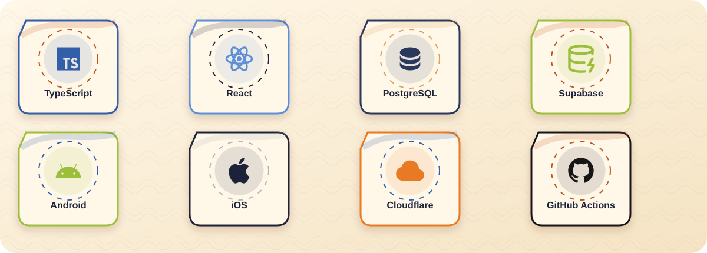
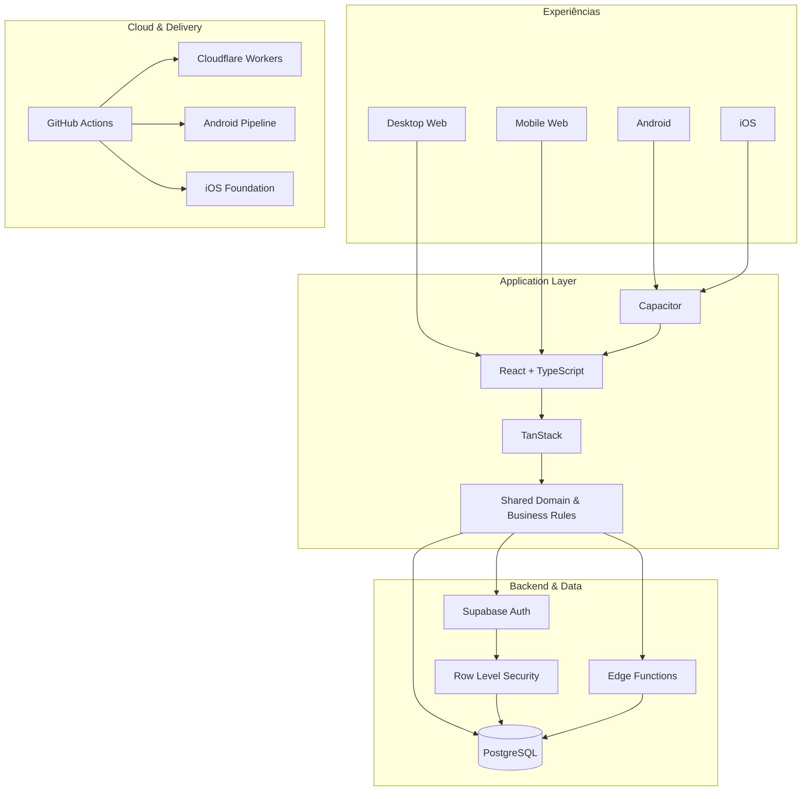
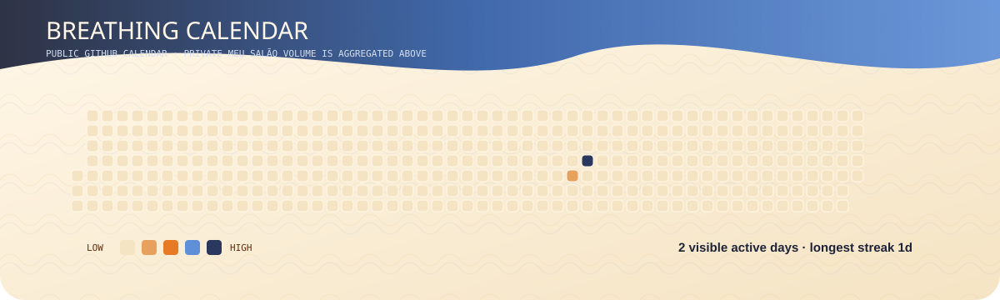
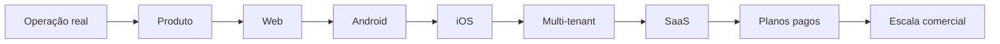

<div align="center">

<picture>
  <source srcset="./banner.webp" type="image/webp">
  
</picture>

<br/>

[](./README.md)
[](./README.en.md)
[](./README.es.md)
[](./README.fr.md)

<br/>


### Full Stack Developer · Product Engineer · Web · Android · iOS · SaaS

**Eu transformo operações reais em produtos digitais robustos, seguros e preparados para escala.**

**[🔥 Conhecer o Meu Salão](https://crm.lollahair.com/)** · **[✉️ Entrar em contato](mailto:gestao.quiroz@gmail.com)**

</div>



## 🐗 Quem é Inosuke

Sou **Desenvolvedor Full Stack e Product Engineer**. Trabalho de ponta a ponta: frontend, backend, banco de dados, autenticação, autorização, regras de negócio, segurança, integrações, cloud, CI/CD e distribuição multiplataforma.

Meu principal case não nasceu como uma landing page ou projeto de portfólio. Nasceu de uma **operação real**, entrou em produção e continua sendo evoluído com base no uso diário.

> **Meu foco é construir software que aguente a rotina real: dados consistentes, regras conectadas, segurança no backend e uma experiência que funcione tanto para quem administra quanto para quem executa a operação.**

<div align="center">
  
</div>


## 🔥 Meu Salão — meu principal produto

**Meu Salão** é uma plataforma completa de gestão para salões e negócios de beleza. O sistema já está em funcionamento real e foi desenvolvido para centralizar operação, clientes, financeiro, estoque, equipe e inteligência gerencial em um único ecossistema.

O código-fonte é **proprietário e privado**. Publicamente, mantenho apenas o ambiente de demonstração e um canal de contato para interessados no produto.

<div align="center">

### [▶ Abrir demonstração do Meu Salão](https://crm.lollahair.com/)

</div>

### O que existe dentro do Meu Salão

<table>
<tr>
<td width="50%" valign="top">

**Agenda & operação**

- agenda diária e semanal;
- organização por profissional;
- bloqueios e indisponibilidades;
- sinal via PIX;
- conflitos de horário;
- status do atendimento;
- experiência específica para desktop e mobile.

</td>
<td width="50%" valign="top">

**CRM & relacionamento**

- cadastro completo de clientes;
- histórico de atendimentos;
- retorno e recorrência;
- aniversários;
- ticket médio;
- cancelamentos e no-shows;
- observações e relacionamento.

</td>
</tr>
<tr>
<td width="50%" valign="top">

**Financeiro & rentabilidade**

- comandas e cobranças;
- múltiplas formas de pagamento;
- despesas e custos;
- fluxo de caixa;
- resultado operacional;
- margem e rentabilidade;
- metas e ponto de equilíbrio.

</td>
<td width="50%" valign="top">

**Estoque, equipe & gestão**

- produtos e estoque;
- entradas, saídas e consumo;
- dose técnica e custo por atendimento;
- serviços, pacotes e precificação;
- profissionais e comissões;
- cargos e permissões;
- relatórios e indicadores.

</td>
</tr>
</table>

### Multiplataforma

| Plataforma | Situação |
|---|---|
| 🖥️ **Desktop Web** | ✅ Em operação |
| 📱 **Mobile Web** | ✅ Em operação |
| 🤖 **Android** | ✅ Build instalável e testes em dispositivo |
| 🍎 **iOS** | 🛠️ Fundação arquitetural preparada |
| ☁️ **SaaS** | 🚧 Preparação para comercialização e planos pagos |

O **Meu Salão já ultrapassou 704 commits** no repositório principal. Esse volume não aparece como código público porque o produto permanece privado — mas a atividade é representada de forma agregada nos gráficos abaixo.


## ⚔️ Beast Stack — arquitetura e tecnologia

<div align="center">
  
</div>

<details>
<summary><b>🗡️ Abrir arquitetura técnica do Meu Salão</b></summary>
<br/>



</details>

<details>
<summary><b>🛡️ Abrir modelo de segurança</b></summary>
<br/>

```text
Autenticação
    ↓
Validação de sessão
    ↓
Perfil / cargo
    ↓
Permissões da aplicação
    ↓
Row Level Security no banco
    ↓
Somente dados autorizados
```

A proteção não depende apenas do frontend. O controle de acesso também é aplicado na camada de dados.

</details>


## 📜 Beast Activity Ledger — GitHub Analytics

Os gráficos abaixo são **gerados dentro deste próprio repositório** por GitHub Actions. Eles utilizam os dados que o GitHub permite consultar e mantêm o código privado do Meu Salão oculto.

<div align="center">



<br/>



<br/>



</div>

### Números atuais

- **Meu Salão:** 704+ commits conhecidos no projeto privado;
- **Perfil:** contagem automática do repositório público — atualmente acima de 60 commits;
- **Total rastreado:** soma mínima desses dois ambientes;
- **Calendário:** mostra apenas o que o GitHub disponibiliza publicamente por data.

> O volume privado é apresentado como total agregado. Eu não distribuo artificialmente esses commits em datas que o GitHub não disponibilizou, porque prefiro uma métrica correta a um gráfico bonito porém falso.


## 🐾 Como eu penso produto

**Operação real → arquitetura sólida → automação → segurança → multiplataforma → SaaS → escala.**



<details>
<summary><b>🔥 Princípios que eu valorizo</b></summary>
<br/>

- código modular e compreensível;
- regras de negócio centralizadas;
- segurança no backend e no banco;
- UX pensada para uso diário;
- automações que reduzem trabalho real;
- consistência de dados entre módulos;
- pipelines reproduzíveis;
- evolução sem quebrar funcionalidades existentes;
- produto orientado ao problema, não à moda tecnológica.

</details>


<div align="center">

## Quer conhecer o Meu Salão ou conversar sobre um projeto?

### **[🔥 Abrir demonstração](https://crm.lollahair.com/)** · **[✉️ Entrar em contato](mailto:gestao.quiroz@gmail.com)**

<br/>

**Inosuke · Full Stack Developer · Product Engineer**

`Web` · `Android` · `iOS` · `SaaS` · `Cloud` · `Security` · `CI/CD`

</div>
