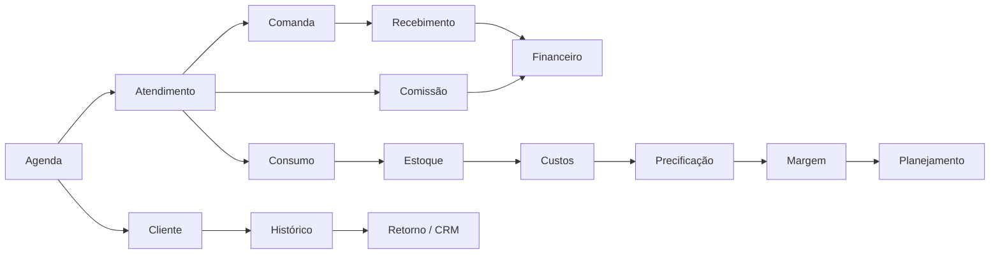
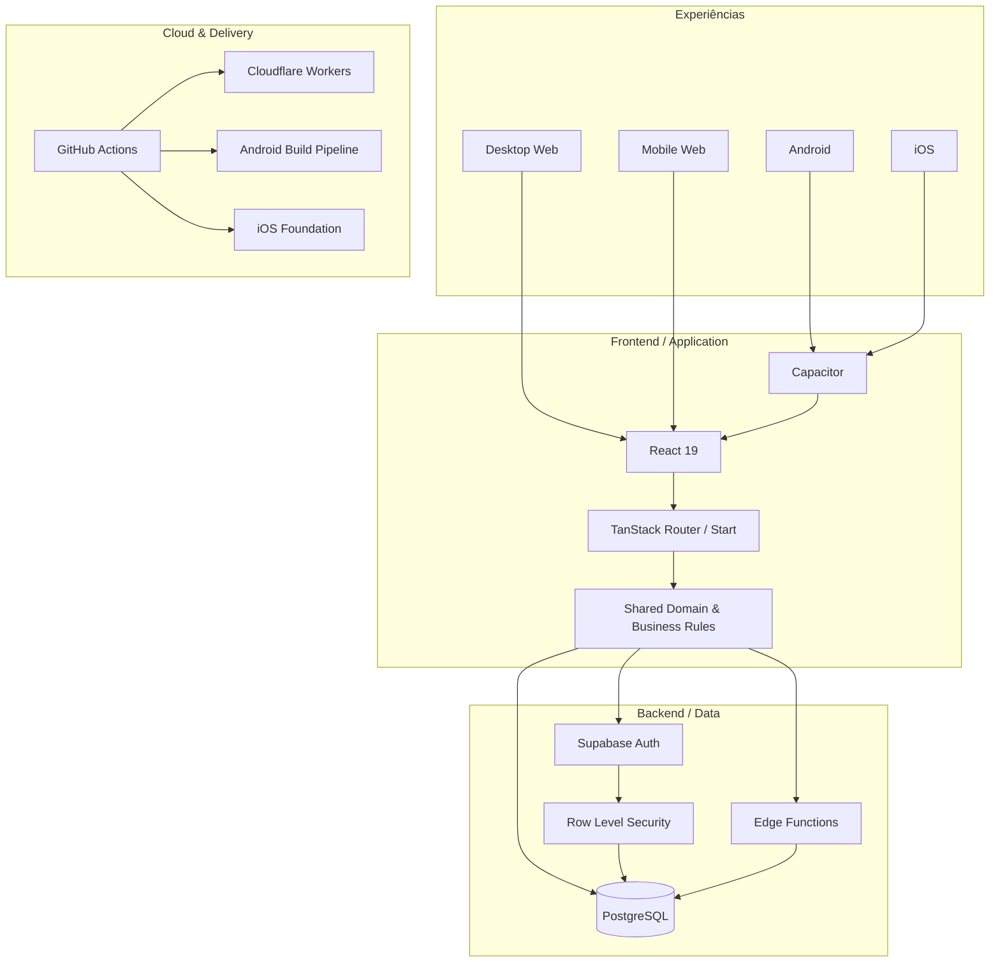
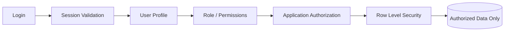
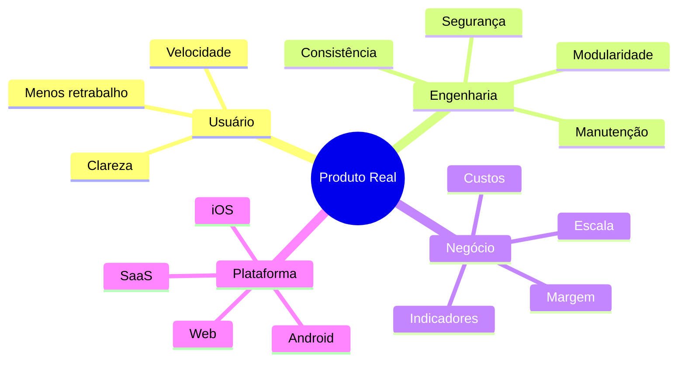
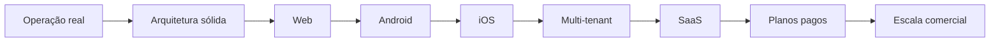

 

 

---

## ⚡ Sobre mim

Sou **Desenvolvedor Full Stack** focado em construir produtos digitais completos, robustos e preparados para uso real.

Meu trabalho envolve muito mais do que interface: atuo na construção e evolução de sistemas de ponta a ponta — **frontend, backend, banco de dados, autenticação, autorização, segurança, regras de negócio, integrações, cloud, CI/CD e distribuição multiplataforma**.

Hoje, meu principal case é uma plataforma de gestão criada para uma operação real do setor de beleza e evoluída como produto de software, com arquitetura para **Desktop Web, Mobile Web, Android e iOS**, além de preparação para um futuro modelo **SaaS comercial com planos pagos**.

> **Eu gosto de transformar problemas operacionais complexos em software claro, integrado e sustentável.**

 

  

---

## 🚀 Meu principal case de engenharia

### Plataforma completa de gestão para salões e negócios de beleza

O projeto nasceu para resolver uma operação real e hoje concentra diversos domínios de negócio em um único ecossistema.

<table>
<tr>
<td width="50%" valign="top">

### 🗓️ Operação

- Agenda diária e semanal
- Gestão por profissional
- Bloqueios e indisponibilidades
- Sinal via PIX
- Status de atendimento
- Conflitos de agenda
- WhatsApp operacional
- Experiência específica para desktop e mobile

</td>
<td width="50%" valign="top">

### 👥 CRM

- Cadastro completo de clientes
- Histórico de atendimentos
- Retorno e repescagem
- Aniversários
- Receita histórica
- Ticket médio
- Cancelamentos e no-shows
- Anotações e relacionamento

</td>
</tr>
<tr>
<td width="50%" valign="top">

### 💰 Financeiro

- Comandas
- Cobranças
- Recebimentos
- Múltiplas formas de pagamento
- Despesas
- Custos fixos e variáveis
- Fluxo de caixa
- Resultado operacional
- Margem e rentabilidade
- Metas e ponto de equilíbrio

</td>
<td width="50%" valign="top">

### 📦 Gestão

- Produtos e estoque
- Entradas e saídas
- Consumo interno
- Dose técnica
- Custo por atendimento
- Serviços e pacotes
- Precificação
- Comissões
- Relatórios e indicadores

</td>
</tr>
</table>

### 🌐 Sistema em funcionamento

---

## 🧠 O diferencial: integração entre módulos

Não é um conjunto de telas isoladas.

A arquitetura foi pensada para que os módulos conversem entre si e reflitam automaticamente as regras da operação.

Essa integração permite transformar uma operação diária em **dados financeiros, históricos e gerenciais consistentes**.

---

## 📱 Engenharia multiplataforma

| Plataforma | Situação |
|---|---|
| 🖥️ **Desktop Web** | ✅ Em funcionamento |
| 📱 **Mobile Web** | ✅ Em funcionamento |
| 🤖 **Android** | ✅ Build nativo híbrido e testes em dispositivo |
| 🍎 **iOS** | 🛠️ Estrutura preparada para evolução e distribuição |
| ☁️ **SaaS** | 🚧 Evolução para comercialização e planos pagos |

A mesma camada de domínio e dados pode alimentar experiências diferentes sem reduzir o mobile a uma simples cópia comprimida do desktop.

---

## 🏗️ Arquitetura técnica

---

## 🧰 Tech Stack

### Frontend

### Backend & Data

### Mobile

### Cloud & DevOps

---

## 🔐 Segurança não é detalhe

A aplicação trabalha com proteção em múltiplas camadas:

### Princípios aplicados

- autenticação centralizada;
- autorização por cargo e permissão;
- isolamento de dados na camada do banco;
- políticas RLS;
- validação de sessão;
- operações administrativas restritas;
- separação entre interface e regra de autorização;
- proteção contra acesso indevido mesmo fora do frontend.

---

## 🧩 Competências que aplico na prática

<table>
<tr>
<td><b>Frontend Engineering</b></td>
<td>React, TypeScript, componentização, UX operacional, desktop e mobile dedicados</td>
</tr>
<tr>
<td><b>Backend Engineering</b></td>
<td>Edge Functions, autenticação, autorização, APIs e regras de negócio</td>
</tr>
<tr>
<td><b>Database Engineering</b></td>
<td>PostgreSQL, modelagem relacional, SQL, RLS e consistência de dados</td>
</tr>
<tr>
<td><b>Mobile</b></td>
<td>Capacitor, Android e base arquitetural para iOS</td>
</tr>
<tr>
<td><b>Cloud</b></td>
<td>Cloudflare Workers, Supabase e ambientes de produção</td>
</tr>
<tr>
<td><b>DevOps</b></td>
<td>GitHub Actions, CI/CD, build, validação e geração de artefatos</td>
</tr>
<tr>
<td><b>Product Engineering</b></td>
<td>Transformação de necessidade real em sistema integrado e evolutivo</td>
</tr>
<tr>
<td><b>Business Systems</b></td>
<td>CRM, agenda, estoque, financeiro, custos, comissões e relatórios</td>
</tr>
</table>

---

## 🎯 Como penso produto

> Software bom não é apenas o que funciona em uma apresentação. É o que continua funcionando quando entra na rotina de uma operação real.

---

## 📊 GitHub Analytics

 

 

> ℹ️ Alguns projetos e ambientes podem ser privados; métricas públicas não necessariamente representam toda a atividade de desenvolvimento.

---

## 🐍 Contribution Snake

<picture>
  <source media="(prefers-color-scheme: dark)" srcset="https://raw.githubusercontent.com/gestao-quiroz/SobreMim/output/github-contribution-grid-snake-dark.svg">
  <source media="(prefers-color-scheme: light)" srcset="https://raw.githubusercontent.com/gestao-quiroz/SobreMim/output/github-contribution-grid-snake.svg">
  
</picture>

---

## 🛣️ Roadmap profissional / produto

Meu foco atual está na evolução de um produto real para uma plataforma cada vez mais independente, distribuível e preparada para comercialização.

---

<b>🧠 O que mais valorizo em engenharia</b>

 

- Código modular e compreensível
- Regras de negócio centralizadas
- Segurança no backend e no banco
- Interfaces pensadas para uso diário
- Automação que realmente reduz trabalho
- Dados consistentes entre módulos
- Pipelines reproduzíveis
- Deploy confiável
- Arquitetura preparada para a próxima etapa do produto

<b>⚙️ Áreas que mais gosto de resolver</b>

 

- sistemas internos complexos;
- CRMs e ERPs verticais;
- automações operacionais;
- dashboards gerenciais;
- integrações entre financeiro e operação;
- permissões e segurança;
- migração de processos manuais para software;
- aplicações multiplataforma;
- evolução de ferramenta interna para SaaS.

---

## 🌎 Construindo software para uso real

  

**Full Stack Development · Product Engineering · SaaS · Web · Android · iOS · Cloud**

 

