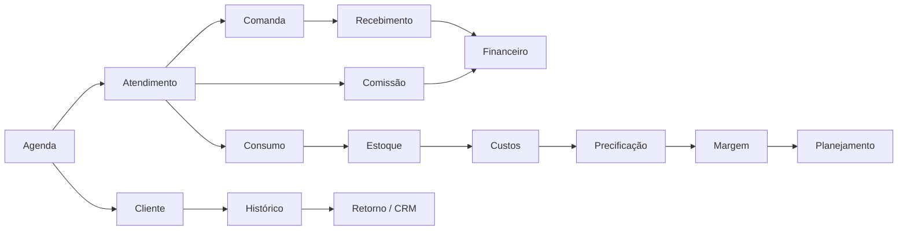
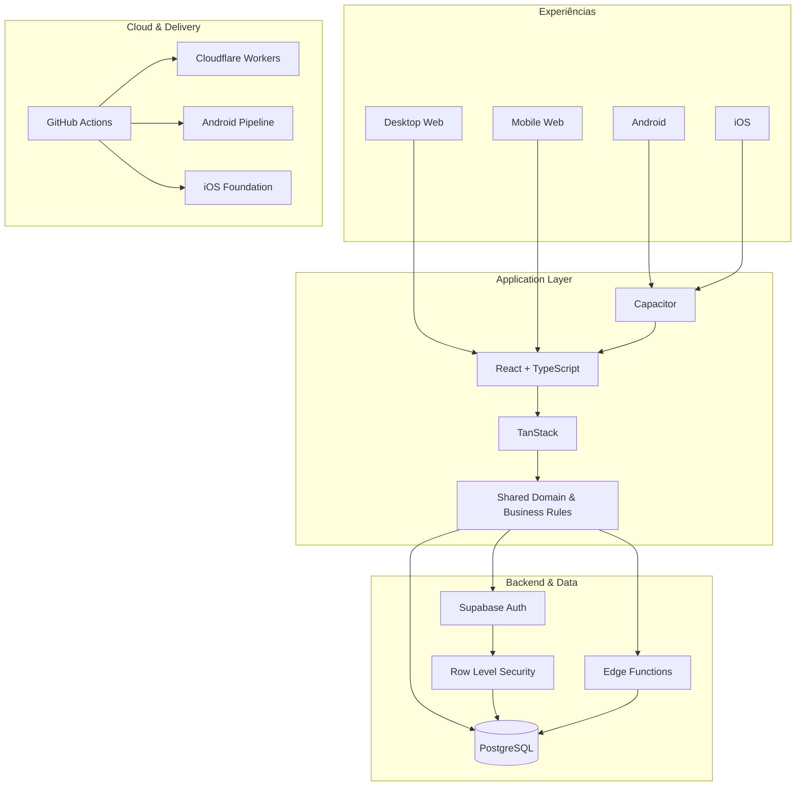
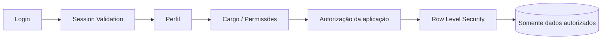
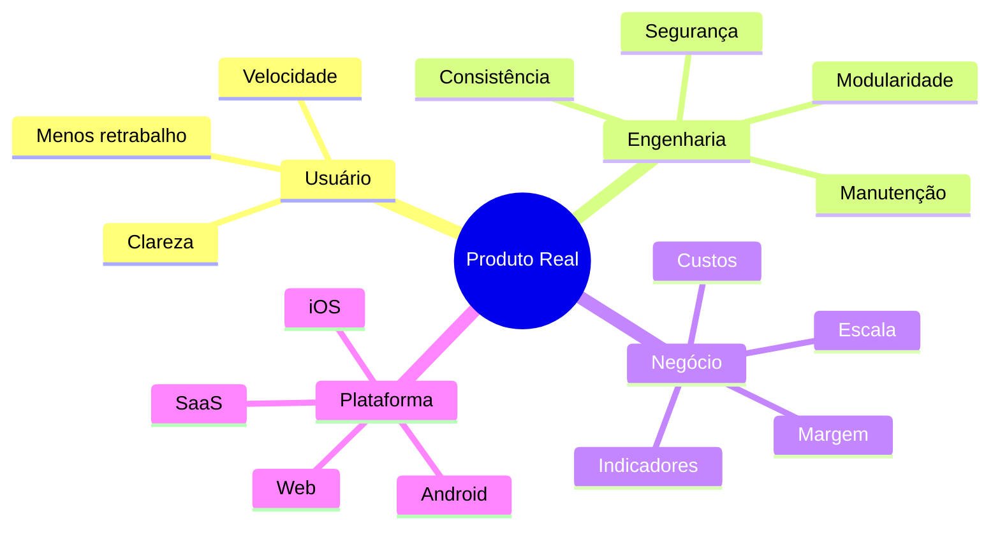
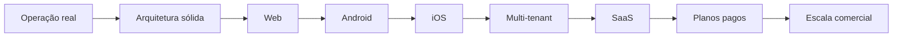

<picture>
  <source srcset="./banner.webp" type="image/webp">
  
</picture>

 

### 🌐 Este perfil também está disponível em outros idiomas

 

# Quiroz

### Full Stack Developer · Product Engineer · Web · Android · iOS · SaaS

**Transformando operações reais em software robusto, seguro e escalável.**

**[🌐 Ver demonstração](https://crm.lollahair.com/)** · **[✉️ Entrar em contato](mailto:gestao.quiroz@gmail.com)**

---

  

---

## ⚡ Sobre mim

Sou **Desenvolvedor Full Stack** com foco em transformar processos complexos em produtos digitais completos, claros e sustentáveis.

Atuo de ponta a ponta: **frontend, backend, banco de dados, autenticação, autorização, segurança, regras de negócio, integrações, cloud, CI/CD e distribuição multiplataforma**.

Meu principal case nasceu de uma necessidade operacional real e evoluiu para uma plataforma robusta de gestão, utilizada em produção e arquitetada para **Desktop Web, Mobile Web, Android e iOS**, com evolução planejada para um modelo **SaaS comercial**.

> **Não construo apenas telas. Construo sistemas em que operação, dados, segurança e negócio funcionam como um único produto.**

---

  

---

## 🚀 Principal case de engenharia

### Plataforma completa de gestão para negócios de beleza

O produto conecta diferentes áreas operacionais e gerenciais em um mesmo ecossistema.

<table>
<tr>
<td width="50%" valign="top">

### 🗓️ Operação
- Agenda diária e semanal
- Gestão por profissional
- Bloqueios e indisponibilidades
- Sinal via PIX
- Status de atendimento
- Detecção de conflitos
- WhatsApp operacional
- UX específica para desktop e mobile

</td>
<td width="50%" valign="top">

### 👥 CRM
- Cadastro e histórico de clientes
- Atendimentos e recorrência
- Retorno e repescagem
- Aniversários
- Receita histórica
- Ticket médio
- Cancelamentos e no-shows
- Relacionamento e observações

</td>
</tr>
<tr>
<td width="50%" valign="top">

### 💰 Financeiro
- Comandas e cobranças
- Recebimentos
- Múltiplas formas de pagamento
- Despesas e custos
- Fluxo de caixa
- Resultado operacional
- Margem e rentabilidade
- Metas e ponto de equilíbrio

</td>
<td width="50%" valign="top">

### 📦 Gestão
- Produtos e estoque
- Entradas, saídas e consumo
- Dose técnica
- Custo por atendimento
- Serviços e pacotes
- Precificação
- Comissões
- Relatórios e indicadores

</td>
</tr>
</table>

### 🔒 Código privado. Produto demonstrável.

O código-fonte desse sistema é **proprietário e permanece privado**. Publicamente, disponibilizo apenas o ambiente de demonstração e o contato para interessados.

**[▶ Abrir demonstração](https://crm.lollahair.com/)** · **[✉ Falar comigo sobre o produto](mailto:gestao.quiroz@gmail.com?subject=Interesse%20no%20produto%20de%20gest%C3%A3o)**

---

## 🧠 O diferencial: integração real entre módulos

Não é um CRUD com telas isoladas. As regras de negócio conectam os módulos para manter operação, financeiro, estoque e relacionamento consistentes.

---

## 📱 Engenharia multiplataforma

| Plataforma | Estado |
|---|---|
| 🖥️ **Desktop Web** | ✅ Em operação |
| 📱 **Mobile Web** | ✅ Em operação |
| 🤖 **Android** | ✅ Build instalável e testes em dispositivo |
| 🍎 **iOS** | 🛠️ Fundação arquitetural preparada |
| ☁️ **SaaS** | 🚧 Evolução para comercialização e planos pagos |

A experiência mobile não é uma miniatura do desktop: as duas interfaces compartilham domínio e dados, mas são pensadas para contextos diferentes de uso.

---

## 🏗️ Arquitetura técnica

---

## 🧰 Stack principal

**Frontend**  
`TypeScript` · `React 19` · `TanStack Router / Start` · `Vite` · `Tailwind CSS`

**Backend & Data**  
`Supabase` · `PostgreSQL` · `Edge Functions` · `Node.js` · `SQL`

**Mobile**  
`Capacitor` · `Android` · `iOS Foundation`

**Cloud & DevOps**  
`Cloudflare Workers` · `GitHub Actions` · `CI/CD` · `Git`

---

## 🔐 Segurança como parte da arquitetura

- autenticação centralizada;
- autorização por cargo e permissão;
- isolamento de dados no banco;
- políticas RLS;
- validação de sessão;
- operações administrativas restritas;
- proteção que não depende apenas do frontend.

---

## 🧩 Competências aplicadas na prática

| Área | Aplicação |
|---|---|
| **Frontend Engineering** | React, TypeScript, componentização, UX desktop/mobile |
| **Backend Engineering** | Edge Functions, autenticação, APIs e regras de negócio |
| **Database Engineering** | PostgreSQL, modelagem relacional, SQL e RLS |
| **Security Engineering** | Auth, RBAC, RLS e isolamento de acesso |
| **Mobile Engineering** | Capacitor, Android e base para iOS |
| **Cloud** | Cloudflare Workers e Supabase |
| **DevOps** | GitHub Actions, CI/CD, builds e artefatos |
| **Product Engineering** | Do problema real à arquitetura de produto |
| **Business Systems** | CRM, agenda, financeiro, estoque, custos, comissões e relatórios |

---

## 📊 GitHub Analytics — hospedado no próprio repositório

Os gráficos abaixo **não dependem de GitHub Readme Stats, Streak Stats ou outros serviços externos**. Eles são SVGs gerados automaticamente por um workflow deste próprio repositório e atualizados diariamente.

 

 

### Como as contribuições privadas são tratadas

O gerador utiliza a API oficial do GitHub. Quando sua configuração **Include private contributions on my profile** estiver ativada, a atividade privada que o GitHub permite expor de forma agregada entra nas métricas sem revelar o nome ou o código do repositório privado.

Para métricas privadas detalhadas autorizadas — por exemplo, contabilização exata de commits em repositórios privados — o workflow já suporta um token opcional chamado `PROFILE_STATS_TOKEN`. Esse token fica armazenado apenas em **GitHub Actions Secrets** e nunca aparece no README ou no código.

---

## 🐍 Contribution Snake

<picture>
  <source media="(prefers-color-scheme: dark)" srcset="https://raw.githubusercontent.com/gestao-quiroz/gestao-quiroz/output/github-contribution-grid-snake-dark.svg">
  <source media="(prefers-color-scheme: light)" srcset="https://raw.githubusercontent.com/gestao-quiroz/gestao-quiroz/output/github-contribution-grid-snake.svg">
  
</picture>

Gerada automaticamente pelo GitHub Actions deste repositório.

---

## 🎯 Como penso produto

> **Software bom não é apenas o que funciona na apresentação. É o que continua funcionando quando entra na rotina de uma operação real.**

---

## 🛣️ Roadmap

---

<b>🧠 Princípios de engenharia que valorizo</b>

 

- Código modular e compreensível
- Regras de negócio centralizadas
- Segurança no backend e no banco
- Interfaces pensadas para uso diário
- Automação que reduz trabalho real
- Dados consistentes entre módulos
- Pipelines reproduzíveis
- Evolução sem quebrar funcionalidades existentes
- Produto orientado ao problema, não à moda tecnológica

---

### Quer conhecer o produto ou conversar sobre um projeto?

**[🌐 Ver demonstração](https://crm.lollahair.com/)** · **[✉️ Entrar em contato](mailto:gestao.quiroz@gmail.com)**

  

**Quiroz · Full Stack Developer · Product Engineer**

`Web` · `Android` · `iOS` · `SaaS` · `Cloud` · `Security` · `CI/CD`

